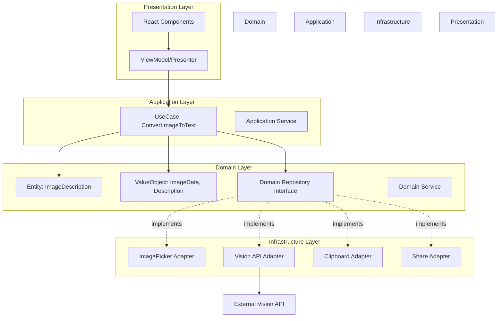

# 設計仕様書: 写真のテキスト変換機能

## 1. 設計概要

### 問題領域

React Nativeアプリケーションで画像をテキストに変換する機能を、保守性・拡張性・テスタビリティを担保しながら実装する必要がある。外部API依存、プラットフォーム固有の機能（カメラ・ギャラリー）、非同期処理、エラーハンドリング等の複雑性を適切に管理する必要がある。

### 提案するソリューション

**クリーンアーキテクチャ + ドメイン駆動設計**を採用し、以下の層に分離する:

- **Domain層**: ビジネスロジックとドメインモデル（Entity, ValueObject, UseCase）
- **Application層**: ユースケース実行とアプリケーションサービス
- **Infrastructure層**: 外部サービス連携（API、デバイス機能）
- **Presentation層**: UI（React Component）と状態管理

依存関係は外から内（Presentation → Application → Domain）とし、内部層は外部層に依存しない。Infrastructure層はInterfaceを通じてDomain層から利用される（依存性逆転の原則）。

## 2. アーキテクチャ

### システム構成図



### レイヤー構成

```
src/
├── domain/                                    # Domain Layer
│   ├── entities/
│   │   └── image-description.entity.ts        # 画像説明エンティティ
│   ├── value-objects/
│   │   ├── image-data.value-object.ts         # 画像データ値オブジェクト
│   │   ├── description.value-object.ts        # 説明テキスト値オブジェクト
│   │   └── conversion-status.value-object.ts  # 変換ステータス
│   ├── repositories/                          # Repository Interface（抽象）
│   │   ├── image-picker.repository.ts
│   │   ├── vision.repository.ts
│   │   ├── clipboard.repository.ts
│   │   └── share.repository.ts
│   └── services/
│       └── image-validation.service.ts        # ドメインサービス
│
├── application/                               # Application Layer
│   ├── use-cases/
│   │   ├── select-image.use-case.ts           # 画像選択ユースケース
│   │   ├── convert-image-to-text.use-case.ts  # 変換ユースケース
│   │   ├── copy-text.use-case.ts              # コピーユースケース
│   │   └── share-text.use-case.ts             # 共有ユースケース
│   └── dto/
│       └── image-conversion.dto.ts            # データ転送オブジェクト
│
├── infrastructure/                            # Infrastructure Layer
│   ├── adapters/
│   │   ├── image-picker.adapter.ts            # react-native-image-picker実装
│   │   ├── vision-api.adapter.ts              # Vision API実装
│   │   ├── clipboard.adapter.ts               # Clipboard実装
│   │   └── share.adapter.ts                   # Share実装
│   └── config/
│       └── api.config.ts                      # API設定
│
└── presentation/                              # Presentation Layer
    ├── screens/
    │   └── image-to-text.screen.tsx           # メイン画面
    ├── components/
    │   ├── image-picker.component.tsx         # 画像選択コンポーネント
    │   ├── image-preview.component.tsx        # 画像プレビュー
    │   ├── conversion-result.component.tsx    # 変換結果表示
    │   └── action-buttons.component.tsx       # アクションボタン群
    ├── state/
    │   └── image-conversion.atoms.ts          # Jotai atoms定義
    └── hooks/
        └── use-image-conversion.hook.ts       # カスタムフック（UseCaseとAtomを連携）
```

### コンポーネント設計

#### Domain Layer

| コンポーネント | 責務 | 入力 | 出力 | 依存 |
|:--------------|:-----|:-----|:-----|:-----|
| ImageDescription (Entity) | 画像と説明テキストの関係を表現 | ImageData, Description | ImageDescription | ValueObjects |
| ImageData (ValueObject) | 画像データの不変オブジェクト | uri, type, size | ImageData | なし |
| Description (ValueObject) | 説明テキストの不変オブジェクト | text, confidence | Description | なし |
| ConversionStatus (ValueObject) | 変換状態を表現 | status enum | ConversionStatus | なし |
| ImageValidationService | 画像の妥当性検証 | ImageData | ValidationResult | ImageData |
| VisionRepository | Vision API抽象インターフェース | ImageData | Description | なし |
| ImagePickerRepository | 画像選択抽象インターフェース | PickerOptions | ImageData | なし |

#### Application Layer

| コンポーネント | 責務 | 入力 | 出力 | 依存 |
|:--------------|:-----|:-----|:-----|:-----|
| SelectImageUseCase | 画像選択のビジネスロジック | source type | Result<ImageData> | ImagePickerRepository, ImageValidationService |
| ConvertImageToTextUseCase | 画像→テキスト変換のオーケストレーション | ImageData | Result<ImageDescription> | VisionRepository, ImageValidationService |
| CopyTextUseCase | テキストコピーのビジネスロジック | Description | Result<void> | ClipboardRepository |
| ShareTextUseCase | テキスト共有のビジネスロジック | Description | Result<void> | ShareRepository |

#### Infrastructure Layer

| コンポーネント | 責務 | 入力 | 出力 | 依存 |
|:--------------|:-----|:-----|:-----|:-----|
| ImagePickerAdapter | ImagePickerRepository実装 | PickerOptions | ImageData | react-native-image-picker |
| VisionApiAdapter | VisionRepository実装 | ImageData | Description | Vision API SDK |
| ClipboardAdapter | ClipboardRepository実装 | string | void | @react-native-clipboard/clipboard |
| ShareAdapter | ShareRepository実装 | string | void | react-native-share |
| ApiConfig | API設定管理 | - | config | react-native-config |

#### Presentation Layer

| コンポーネント | 責務 | 入力 | 出力 | 依存 |
|:--------------|:-----|:-----|:-----|:-----|
| ImageToTextScreen | メイン画面のコンテナ | - | JSX | useImageConversion |
| imageConversionAtoms | Jotai atoms（状態管理） | - | atoms | なし |
| useImageConversion | UseCaseとAtomを連携するフック | - | handlers, state | UseCases, Jotai atoms |
| ImagePicker | 画像選択UI | onSelect | - | なし（Pure Component） |
| ConversionResult | 変換結果表示UI | description, onEdit | - | なし（Pure Component） |

## 3. 技術選択とトレードオフ

### 検討した選択肢

#### Vision API選定

| 選択肢 | メリット | デメリット | 採用/不採用 |
|:------|:---------|:----------|:-----------|
| Google Cloud Vision API | 高精度、多機能、日本語対応良好 | コスト高、レスポンス時間やや遅い | 不採用: コスト面 |
| AWS Rekognition | AWS統合、コスト効率良好 | 日本語説明生成に弱い | 不採用: 日本語対応 |
| **OpenAI Vision API（採用）** | 自然な日本語説明、高精度、レスポンス良好 | 利用規約の制約、APIキー管理必要 | **採用**: 要件との適合性が最高 |

#### 状態管理ライブラリ

| 選択肢 | メリット | デメリット | 採用/不採用 |
|:------|:---------|:----------|:-----------|
| Redux Toolkit | 成熟、DevTools充実 | ボイラープレート多、小規模には過剰 | 不採用: オーバーエンジニアリング |
| Zustand | 軽量、シンプル、学習コスト低 | グローバル状態寄り、Atom単位の最適化なし | 不採用: 細かい再レンダリング制御が不十分 |
| **Jotai（採用）** | Atomic設計、React Suspense対応、TypeScript親和性高、軽量、ボトムアップな状態設計 | エコシステムは小さめ | **採用**: React哲学と整合、Clean Architectureと相性良好 |

#### 画像処理ライブラリ

| 選択肢 | メリット | デメリット | 採用/不採用 |
|:------|:---------|:----------|:-----------|
| Expo ImagePicker | 簡単、Expo統合 | Expo依存、カスタマイズ制限 | 不採用: 制約の要件に合わない |
| **react-native-image-picker（採用）** | ネイティブ統合、カスタマイズ可、軽量 | 設定やや複雑 | **採用**: 要件を満たし実績豊富 |

### トレードオフ分析

- **性能 vs 複雑性**:
  - レイヤー分離により複雑性は増すが、保守性・テスタビリティを優先
  - 初期開発コスト > 長期保守コストの削減を重視

- **開発速度 vs 保守性**:
  - Clean Architectureにより初期開発は遅くなるが、長期的な保守性を優先
  - ユースケース単位での段階的実装が可能

- **コスト vs 品質**:
  - OpenAI Vision APIはコストやや高いが、日本語説明品質を優先
  - ユーザー体験の向上を最優先事項とする

## 4. 非機能要件との整合性

| NFR項目 | 要求値 | 設計での実現方法 | 想定達成値 |
|:--------|:-------|:----------------|:----------|
| レスポンスタイム | p95 < 10秒 | OpenAI Vision API（通常3-5秒）+ リトライ機構 | ~7秒 |
| 画像サイズ制限 | 最大10MB | ImageValidationServiceでバリデーション | 10MB厳守 |
| 対応画像形式 | JPEG, PNG, HEIC | ImageDataでフォーマット検証 | 対応完全 |
| リトライ | 最大3回 | VisionApiAdapterに指数バックオフ実装 | 3回 |
| エラーハンドリング | 適切なメッセージ | Result型でエラー伝搬、ドメイン例外定義 | 100%カバー |
| セキュリティ | HTTPS、APIキー管理 | ApiConfigで環境変数管理、HTTPS強制 | 準拠 |
| テスタビリティ | 単体テスト可能 | DI、インターフェース分離でモック化容易 | 80%以上 |

## 5. ドメインモデル詳細設計

### Entity: ImageDescription

```typescript
export class ImageDescription {
  private readonly _id: string;
  private readonly _imageData: ImageData;
  private _description: Description;
  private _status: ConversionStatus;
  private readonly _createdAt: Date;
  private _updatedAt: Date;

  constructor(
    id: string,
    imageData: ImageData,
    status: ConversionStatus = ConversionStatus.pending()
  ) {
    this._id = id;
    this._imageData = imageData;
    this._status = status;
    this._createdAt = new Date();
    this._updatedAt = new Date();
  }

  // ドメインロジック: 変換完了
  completeConversion(description: Description): void {
    this._description = description;
    this._status = ConversionStatus.completed();
    this._updatedAt = new Date();
  }

  // ドメインロジック: 変換失敗
  failConversion(error: Error): void {
    this._status = ConversionStatus.failed(error.message);
    this._updatedAt = new Date();
  }

  // ドメインロジック: 説明編集
  editDescription(newText: string): void {
    if (!this._description) {
      throw new DomainError('Cannot edit description before conversion');
    }
    this._description = Description.create(newText, this._description.confidence);
    this._updatedAt = new Date();
  }

  get id(): string { return this._id; }
  get imageData(): ImageData { return this._imageData; }
  get description(): Description | undefined { return this._description; }
  get status(): ConversionStatus { return this._status; }
  get isConversionCompleted(): boolean {
    return this._status.equals(ConversionStatus.completed());
  }
}
```

### ValueObject: ImageData

```typescript
export class ImageData {
  private constructor(
    private readonly _uri: string,
    private readonly _type: ImageType,
    private readonly _fileSize: number,
    private readonly _width: number,
    private readonly _height: number
  ) {}

  static create(params: {
    uri: string;
    type: string;
    fileSize: number;
    width: number;
    height: number;
  }): Result<ImageData> {
    // バリデーション
    if (!params.uri) {
      return Result.fail('URI is required');
    }

    const imageType = ImageType.fromString(params.type);
    if (!imageType) {
      return Result.fail(`Unsupported image type: ${params.type}`);
    }

    if (params.fileSize > 10 * 1024 * 1024) { // 10MB
      return Result.fail('Image size exceeds 10MB limit');
    }

    return Result.ok(
      new ImageData(
        params.uri,
        imageType,
        params.fileSize,
        params.width,
        params.height
      )
    );
  }

  get uri(): string { return this._uri; }
  get type(): ImageType { return this._type; }
  get fileSize(): number { return this._fileSize; }
  get width(): number { return this._width; }
  get height(): number { return this._height; }

  // ValueObjectは不変なので等価性比較が重要
  equals(other: ImageData): boolean {
    return this._uri === other._uri;
  }
}
```

### ValueObject: Description

```typescript
export class Description {
  private constructor(
    private readonly _text: string,
    private readonly _confidence?: number
  ) {}

  static create(text: string, confidence?: number): Description {
    if (!text || text.trim().length === 0) {
      throw new DomainError('Description text cannot be empty');
    }

    if (confidence !== undefined && (confidence < 0 || confidence > 1)) {
      throw new DomainError('Confidence must be between 0 and 1');
    }

    return new Description(text.trim(), confidence);
  }

  get text(): string { return this._text; }
  get confidence(): number | undefined { return this._confidence; }
  get hasHighConfidence(): boolean {
    return this._confidence !== undefined && this._confidence >= 0.8;
  }

  equals(other: Description): boolean {
    return this._text === other._text;
  }
}
```

### ValueObject: ConversionStatus

```typescript
export enum ConversionStatusType {
  PENDING = 'PENDING',
  PROCESSING = 'PROCESSING',
  COMPLETED = 'COMPLETED',
  FAILED = 'FAILED'
}

export class ConversionStatus {
  private constructor(
    private readonly _type: ConversionStatusType,
    private readonly _errorMessage?: string
  ) {}

  static pending(): ConversionStatus {
    return new ConversionStatus(ConversionStatusType.PENDING);
  }

  static processing(): ConversionStatus {
    return new ConversionStatus(ConversionStatusType.PROCESSING);
  }

  static completed(): ConversionStatus {
    return new ConversionStatus(ConversionStatusType.COMPLETED);
  }

  static failed(errorMessage: string): ConversionStatus {
    return new ConversionStatus(ConversionStatusType.FAILED, errorMessage);
  }

  get type(): ConversionStatusType { return this._type; }
  get errorMessage(): string | undefined { return this._errorMessage; }

  equals(other: ConversionStatus): boolean {
    return this._type === other._type;
  }

  isPending(): boolean { return this._type === ConversionStatusType.PENDING; }
  isProcessing(): boolean { return this._type === ConversionStatusType.PROCESSING; }
  isCompleted(): boolean { return this._type === ConversionStatusType.COMPLETED; }
  isFailed(): boolean { return this._type === ConversionStatusType.FAILED; }
}
```

## 6. UseCase詳細設計

### ConvertImageToTextUseCase

```typescript
export class ConvertImageToTextUseCase {
  constructor(
    private readonly visionRepository: VisionRepository,
    private readonly validationService: ImageValidationService
  ) {}

  async execute(imageData: ImageData): Promise<Result<ImageDescription>> {
    // 1. バリデーション
    const validationResult = this.validationService.validate(imageData);
    if (validationResult.isFailure) {
      return Result.fail(validationResult.error);
    }

    // 2. エンティティ生成
    const imageDescription = new ImageDescription(
      generateId(),
      imageData,
      ConversionStatus.processing()
    );

    try {
      // 3. Vision APIで変換
      const descriptionResult = await this.visionRepository.convertToText(imageData);

      if (descriptionResult.isFailure) {
        imageDescription.failConversion(new Error(descriptionResult.error));
        return Result.fail(descriptionResult.error);
      }

      // 4. 変換完了
      imageDescription.completeConversion(descriptionResult.value);

      return Result.ok(imageDescription);

    } catch (error) {
      imageDescription.failConversion(error as Error);
      return Result.fail((error as Error).message);
    }
  }
}
```

### SelectImageUseCase

```typescript
export class SelectImageUseCase {
  constructor(
    private readonly imagePickerRepository: ImagePickerRepository,
    private readonly validationService: ImageValidationService
  ) {}

  async executeFromGallery(): Promise<Result<ImageData>> {
    const result = await this.imagePickerRepository.pickFromGallery();

    if (result.isFailure) {
      return Result.fail(result.error);
    }

    return this.validateAndReturn(result.value);
  }

  async executeFromCamera(): Promise<Result<ImageData>> {
    const result = await this.imagePickerRepository.pickFromCamera();

    if (result.isFailure) {
      return Result.fail(result.error);
    }

    return this.validateAndReturn(result.value);
  }

  private validateAndReturn(imageData: ImageData): Result<ImageData> {
    const validationResult = this.validationService.validate(imageData);

    if (validationResult.isFailure) {
      return Result.fail(validationResult.error);
    }

    return Result.ok(imageData);
  }
}
```

## 7. Infrastructure実装詳細

### VisionApiAdapter（OpenAI Vision API）

```typescript
export class VisionApiAdapter implements VisionRepository {
  private readonly apiKey: string;
  private readonly baseUrl: string;
  private readonly maxRetries: number = 3;

  constructor(config: ApiConfig) {
    this.apiKey = config.openaiApiKey;
    this.baseUrl = config.openaiBaseUrl;
  }

  async convertToText(imageData: ImageData): Promise<Result<Description>> {
    let lastError: Error;

    for (let attempt = 0; attempt < this.maxRetries; attempt++) {
      try {
        const base64Image = await this.imageToBase64(imageData.uri);

        const response = await fetch(`${this.baseUrl}/v1/chat/completions`, {
          method: 'POST',
          headers: {
            'Content-Type': 'application/json',
            'Authorization': `Bearer ${this.apiKey}`
          },
          body: JSON.stringify({
            model: 'gpt-4-vision-preview',
            messages: [{
              role: 'user',
              content: [
                { type: 'text', text: 'この画像の内容を日本語で詳しく説明してください。' },
                { type: 'image_url', image_url: { url: `data:${imageData.type.mimeType};base64,${base64Image}` } }
              ]
            }],
            max_tokens: 500
          })
        });

        if (!response.ok) {
          throw new Error(`API Error: ${response.status}`);
        }

        const data = await response.json();
        const text = data.choices[0].message.content;

        return Result.ok(Description.create(text));

      } catch (error) {
        lastError = error as Error;

        if (attempt < this.maxRetries - 1) {
          await this.delay(Math.pow(2, attempt) * 1000); // 指数バックオフ
        }
      }
    }

    return Result.fail(`Failed after ${this.maxRetries} attempts: ${lastError.message}`);
  }

  private async imageToBase64(uri: string): Promise<string> {
    const response = await fetch(uri);
    const blob = await response.blob();
    return new Promise((resolve, reject) => {
      const reader = new FileReader();
      reader.onloadend = () => {
        const base64 = (reader.result as string).split(',')[1];
        resolve(base64);
      };
      reader.onerror = reject;
      reader.readAsDataURL(blob);
    });
  }

  private delay(ms: number): Promise<void> {
    return new Promise(resolve => setTimeout(resolve, ms));
  }
}
```

## 8. Presentation層実装パターン（Jotai）

### Jotai Atoms定義

```typescript
// presentation/state/imageConversionAtoms.ts
import { atom } from 'jotai';
import { ImageDescription } from '@/domain/entities/ImageDescription';

// Primitive Atoms
export const imageDescriptionAtom = atom<ImageDescription | null>(null);
export const isLoadingAtom = atom<boolean>(false);
export const errorAtom = atom<string | null>(null);

// Derived Atoms (読み取り専用)
export const imageUriAtom = atom((get) => {
  const imageDescription = get(imageDescriptionAtom);
  return imageDescription?.imageData.uri ?? null;
});

export const descriptionTextAtom = atom((get) => {
  const imageDescription = get(imageDescriptionAtom);
  return imageDescription?.description?.text ?? null;
});

export const canConvertAtom = atom((get) => {
  const imageDescription = get(imageDescriptionAtom);
  const isLoading = get(isLoadingAtom);
  return imageDescription !== null && !isLoading;
});

export const canShareAtom = atom((get) => {
  const imageDescription = get(imageDescriptionAtom);
  return imageDescription?.isConversionCompleted ?? false;
});
```

### Custom Hook（UseCaseとAtomの連携）

```typescript
// presentation/hooks/useImageConversion.ts
import { useAtom, useAtomValue, useSetAtom } from 'jotai';
import { useCallback } from 'react';
import {
  imageDescriptionAtom,
  isLoadingAtom,
  errorAtom,
  imageUriAtom,
  descriptionTextAtom,
  canConvertAtom,
  canShareAtom,
} from '@/presentation/state/imageConversionAtoms';
import { SelectImageUseCase } from '@/application/usecases/SelectImageUseCase';
import { ConvertImageToTextUseCase } from '@/application/usecases/ConvertImageToTextUseCase';
import { CopyTextUseCase } from '@/application/usecases/CopyTextUseCase';
import { ShareTextUseCase } from '@/application/usecases/ShareTextUseCase';
import { ImageDescription } from '@/domain/entities/ImageDescription';
import { generateId } from '@/shared/utils/idGenerator';

export const useImageConversion = (
  selectImageUseCase: SelectImageUseCase,
  convertImageUseCase: ConvertImageToTextUseCase,
  copyTextUseCase: CopyTextUseCase,
  shareTextUseCase: ShareTextUseCase
) => {
  // Atom hooks
  const [imageDescription, setImageDescription] = useAtom(imageDescriptionAtom);
  const [isLoading, setIsLoading] = useAtom(isLoadingAtom);
  const setError = useSetAtom(errorAtom);

  // Derived state (読み取り専用)
  const imageUri = useAtomValue(imageUriAtom);
  const descriptionText = useAtomValue(descriptionTextAtom);
  const canConvert = useAtomValue(canConvertAtom);
  const canShare = useAtomValue(canShareAtom);

  // Handlers
  const selectFromGallery = useCallback(async () => {
    setIsLoading(true);
    const result = await selectImageUseCase.executeFromGallery();

    if (result.isSuccess) {
      setImageDescription(new ImageDescription(generateId(), result.value));
      setError(null);
    } else {
      setError(result.error);
    }

    setIsLoading(false);
  }, [selectImageUseCase, setImageDescription, setIsLoading, setError]);

  const selectFromCamera = useCallback(async () => {
    setIsLoading(true);
    const result = await selectImageUseCase.executeFromCamera();

    if (result.isSuccess) {
      setImageDescription(new ImageDescription(generateId(), result.value));
      setError(null);
    } else {
      setError(result.error);
    }

    setIsLoading(false);
  }, [selectImageUseCase, setImageDescription, setIsLoading, setError]);

  const convertToText = useCallback(async () => {
    if (!imageDescription) {
      setError('No image selected');
      return;
    }

    setIsLoading(true);
    const result = await convertImageUseCase.execute(imageDescription.imageData);

    if (result.isSuccess) {
      setImageDescription(result.value);
      setError(null);
    } else {
      setError(result.error);
    }

    setIsLoading(false);
  }, [imageDescription, convertImageUseCase, setImageDescription, setIsLoading, setError]);

  const copyToClipboard = useCallback(async () => {
    if (!imageDescription?.description) return;

    const result = await copyTextUseCase.execute(imageDescription.description);
    if (result.isFailure) {
      setError(result.error);
    }
  }, [imageDescription, copyTextUseCase, setError]);

  const shareText = useCallback(async () => {
    if (!imageDescription?.description) return;

    const result = await shareTextUseCase.execute(imageDescription.description);
    if (result.isFailure) {
      setError(result.error);
    }
  }, [imageDescription, shareTextUseCase, setError]);

  const editDescription = useCallback(
    (newText: string) => {
      if (!imageDescription) return;

      try {
        imageDescription.editDescription(newText);
        setImageDescription({ ...imageDescription }); // 新しい参照でAtomを更新
      } catch (error) {
        setError((error as Error).message);
      }
    },
    [imageDescription, setImageDescription, setError]
  );

  return {
    // State
    imageUri,
    descriptionText,
    isLoading,
    canConvert,
    canShare,
    // Handlers
    selectFromGallery,
    selectFromCamera,
    convertToText,
    copyToClipboard,
    shareText,
    editDescription,
  };
};
```

### Screen実装例

```typescript
// presentation/screens/ImageToTextScreen.tsx
import React from 'react';
import { View, StyleSheet, ActivityIndicator } from 'react-native';
import { useImageConversion } from '@/presentation/hooks/useImageConversion';
import { ImagePicker } from '@/presentation/components/ImagePicker';
import { ImagePreview } from '@/presentation/components/ImagePreview';
import { ConversionResult } from '@/presentation/components/ConversionResult';
import { ActionButtons } from '@/presentation/components/ActionButtons';
// UseCaseはDI Containerから取得（実装は後述）
import { useDependencies } from '@/di/DependencyContext';

export const ImageToTextScreen: React.FC = () => {
  const {
    selectImageUseCase,
    convertImageUseCase,
    copyTextUseCase,
    shareTextUseCase,
  } = useDependencies();

  const {
    imageUri,
    descriptionText,
    isLoading,
    canConvert,
    canShare,
    selectFromGallery,
    selectFromCamera,
    convertToText,
    copyToClipboard,
    shareText,
    editDescription,
  } = useImageConversion(
    selectImageUseCase,
    convertImageUseCase,
    copyTextUseCase,
    shareTextUseCase
  );

  return (
    <View style={styles.container}>
      {!imageUri && (
        <ImagePicker
          onSelectFromGallery={selectFromGallery}
          onSelectFromCamera={selectFromCamera}
        />
      )}

      {imageUri && <ImagePreview uri={imageUri} />}

      {isLoading && <ActivityIndicator size="large" />}

      {descriptionText && (
        <ConversionResult
          description={descriptionText}
          onEdit={editDescription}
        />
      )}

      {imageUri && (
        <ActionButtons
          canConvert={canConvert}
          canShare={canShare}
          onConvert={convertToText}
          onCopy={copyToClipboard}
          onShare={shareText}
        />
      )}
    </View>
  );
};

const styles = StyleSheet.create({
  container: {
    flex: 1,
    padding: 16,
  },
});
```

## 9. リスク評価

| リスク | 発生確率 | 影響度 | 対策 |
|:------|:---------|:-------|:-----|
| OpenAI API利用制限・料金変更 | 中 | 大 | Repository抽象化により他APIへの切り替え容易化、使用量監視実装 |
| Vision API精度不足 | 低 | 中 | 編集機能提供、複数API候補の技術検証済み |
| ネットワーク不安定によるタイムアウト | 高 | 中 | リトライ機構、適切なタイムアウト設定、オフライン検知 |
| 画像フォーマット非対応 | 低 | 小 | ImageValidationServiceで事前検証、明確なエラーメッセージ |
| メモリ不足（大容量画像） | 中 | 中 | 10MB制限、画像圧縮オプション検討 |
| iOS/Android実装差異 | 中 | 中 | react-native-image-pickerの実績活用、各プラットフォームでテスト |
| Clean Architecture学習コスト | 中 | 小 | ドキュメント整備、ペアプログラミング、コードレビュー |

## 10. 実装考慮事項

### 推定工数

- **Domain層実装**: 2人日
  - Entity, ValueObject, Repository Interface定義
- **Application層実装**: 2人日
  - UseCase実装、Result型実装
- **Infrastructure層実装**: 3人日
  - 各Adapter実装、API統合、リトライ機構
- **Presentation層実装**: 3人日
  - Jotai Atoms定義、Custom Hook実装、Component実装
- **テスト**: 4人日
  - 単体テスト（Domain, Application, Infrastructure）
  - 統合テスト、E2Eテスト
- **iOS/Android固有対応**: 2人日
  - 権限設定、ビルド設定、プラットフォーム固有バグ対応
- **合計**: 16人日（約3週間 @ 1名）

### 必要スキル

- TypeScript（中級以上）
  - Class, Interface, Generics, Type Guard
- React Native（中級以上）
  - Hooks, Custom Hooks, ライフサイクル
- Jotai
  - Atom定義、Derived Atom、useAtom/useAtomValue/useSetAtom
- Clean Architecture理解
  - レイヤー分離、依存性逆転の原則
- ドメイン駆動設計の基礎
  - Entity, ValueObject, Repository概念
- 非同期処理
  - async/await, Promise, エラーハンドリング
- テスト
  - Jest, Testing Library, モック/スタブ

### 実装順序

1. **Domain層** (基礎となる型定義)
   - ValueObject → Entity → Repository Interface → Domain Service
2. **Application層** (ビジネスロジック)
   - UseCase実装
3. **Infrastructure層** (外部連携)
   - Adapter実装（モック → 実装）
4. **Presentation層** (UI)
   - Jotai Atoms → Custom Hook → Component
5. **統合・テスト**
   - DI Container構築 → E2Eテスト

### テスト戦略

- **Domain層**: 単体テスト100%カバレッジ目標
  - Entity, ValueObjectのロジックテスト
- **Application層**: UseCase単体テスト
  - Repository Mockを使用
- **Infrastructure層**: 統合テスト
  - 実際のAPIを使った動作確認（開発環境）
- **Presentation層**: コンポーネントテスト
  - Jotai Atomsのモックを使用、Custom Hookの単体テスト
- **E2E**: 主要フロー
  - 画像選択 → 変換 → 共有

## 11. コーディング規約

このプロジェクトは以下のコーディング規約に準拠する:

1. [TypeScript Deep Dive スタイルガイド](https://typescript-jp.gitbook.io/deep-dive/styleguide)（優先）
2. [Santoku（サントク）アプリ開発スタンダード](https://fintan-contents.github.io/mobile-app-crib-notes/react-native/santoku/development/implement/style-guide/typescript-style-guide/)

競合する場合はTypeScript Deep Diveを優先する。

### 命名規則

| 対象                       | 規則                              | 例                                                   |
| :------------------------- | :-------------------------------- | :--------------------------------------------------- |
| クラス                     | 名詞で先頭大文字（PascalCase）   | `ImageDescription`, `VisionApiAdapter`               |
| インターフェース           | 先頭大文字（PascalCase）、`I`プレフィックスなし | `VisionRepository`, `ImagePickerRepository` |
| 型エイリアス               | 先頭大文字（PascalCase）         | `ImageType`, `ConversionResult`                      |
| Enum                       | PascalCase（名前とメンバ両方）   | `ConversionStatusType.PENDING`                       |
| 名前空間                   | PascalCase                        | `Domain`, `Application`                              |
| 関数・メソッド             | 動詞から始まるcamelCase          | `convertToText()`, `selectFromGallery()`             |
| 変数                       | 名詞でcamelCase                   | `imageData`, `descriptionText`                       |
| 真偽値                     | `is`/`can`/`has`で開始            | `isLoading`, `canConvert`, `hasError`                |
| 定数                       | 全て大文字、単語間アンダースコア | `MAX_FILE_SIZE`, `DEFAULT_RETRY_COUNT`               |
| Privateフィールド          | アンダースコアで開始              | `_imageDescription`, `_isLoading`                    |
| ファイル名                 | ケバブケース + 種別サフィックス   | `image-description.entity.ts`, `vision-api.adapter.ts` |

### 禁止事項

- ❌ 計算式内でインクリメント・デクリメント演算子の使用
- ❌ フィールドを一時変数として使用
- ❌ 配列戻り値で`null`/`undefined`を返す（空配列`[]`を返す）
- ❌ コンストラクタ内でインスタンスメソッド呼び出し
- ❌ `try-catch`を条件分岐目的で使用
- ❌ グローバル変数の定義
- ❌ プロトタイプの拡張

### 推奨事項

#### 変数宣言
```typescript
// ✅ Good: constを優先
const maxRetries = 3;
const imageData = ImageData.create(params);

// ❌ Bad: letの不必要な使用
let maxRetries = 3; // 再代入しない場合
```

#### アクセス修飾子
```typescript
// ✅ Good: 適切なアクセス修飾子
export class ImageDescription {
  private readonly _id: string;
  private _description: Description;

  public get id(): string { return this._id; }
}

// ❌ Bad: public省略（明示する）
export class ImageDescription {
  readonly _id: string; // publicが暗黙的
}
```

#### 配列処理
```typescript
// ✅ Good: Arrayメソッド活用
const validImages = images.filter(img => img.size <= MAX_SIZE);
const uris = validImages.map(img => img.uri);

// ❌ Bad: forループの多用
const uris = [];
for (let i = 0; i < validImages.length; i++) {
  uris.push(validImages[i].uri);
}
```

#### 値の非存在

**重要**: `null`と`undefined`は両方とも使用しないことを推奨。`undefined`を使用する。

```typescript
// ✅ Good: undefinedを優先
function findImage(id: string): ImageData | undefined {
  return images.find(img => img.id === id);
}

// ✅ Better: オブジェクト返却で明示的に
function findImage(id: string): { found: boolean; image?: ImageData } {
  const image = images.find(img => img.id === id);
  return image ? { found: true, image } : { found: false };
}

// ❌ Bad: nullの使用
function findImage(id: string): ImageData | null {
  return images.find(img => img.id === id) || null;
}

// ✅ Good: null/undefinedチェックは == null を使用
if (value == null) {
  // valueがnullまたはundefinedの場合
}

// ❌ Bad: === を使うと両方をチェックできない
if (value === null || value === undefined) {
  // 冗長
}
```

#### スプレッド構文
```typescript
// ✅ Good: スプレッド構文でコピー
const updatedEntity = { ...imageDescription };

// ❌ Bad: Object.assignの使用
const updatedEntity = Object.assign({}, imageDescription);
```

#### テンプレートリテラル
```typescript
// ✅ Good: テンプレートリテラル
const message = `画像サイズ: ${fileSize}MB`;

// ❌ Bad: 文字列連結
const message = '画像サイズ: ' + fileSize + 'MB';
```

### 型定義

#### 配列型

```typescript
// ✅ Good: Foo[] を使用
const images: ImageData[] = [];
const ids: string[] = [];

// ❌ Bad: Array<Foo> は使わない
const images: Array<ImageData> = [];
```

#### type vs interface

```typescript
// ✅ Good: ユニオン型・交差型が必要な場合はtype
type ImageSource = 'gallery' | 'camera';
type ConversionResult = Success | Failure;

// ✅ Good: extend/implementsが必要な場合はinterface
interface VisionRepository {
  convertToText(image: ImageData): Promise<Description>;
}

class VisionApiAdapter implements VisionRepository {
  // ...
}

// その他は好みで選択可能
```

### フォーマット

#### 引用符とセミコロン

```typescript
// ✅ Good: シングルクォートを使用
const message = 'Hello World';
import { ImageData } from './imageData';

// ✅ Good: セミコロンは必須
const value = 10;
const result = getValue();

// ❌ Bad: ダブルクォート
const message = "Hello World";

// ❌ Bad: セミコロン省略
const value = 10
const result = getValue()
```

#### インデント

```typescript
// ✅ Good: 2スペース（タブではない）
function convertImage() {
  if (condition) {
    doSomething();
  }
}
```

### ファイル命名規則（Angular Style）

**パターン**: `{feature-name}.{type}.{extension}`

- 単語区切りはケバブケース（ハイフン`-`）を使用
- 種別を示すサフィックスを付与
- 1ファイル = 1つの`export`が原則

#### 命名例

| 種別 | サフィックス | 例 |
|:-----|:------------|:---|
| Entity | `.entity.ts` | `image-description.entity.ts` |
| ValueObject | `.value-object.ts` | `image-data.value-object.ts` |
| Repository Interface | `.repository.ts` | `vision.repository.ts` |
| UseCase | `.use-case.ts` | `convert-image-to-text.use-case.ts` |
| Service | `.service.ts` | `image-validation.service.ts` |
| Adapter | `.adapter.ts` | `vision-api.adapter.ts` |
| Config | `.config.ts` | `api.config.ts` |
| Component (React) | `.component.tsx` | `image-picker.component.tsx` |
| Screen (React) | `.screen.tsx` | `image-to-text.screen.tsx` |
| Hook | `.hook.ts` | `use-image-conversion.hook.ts` |
| Atoms (Jotai) | `.atoms.ts` | `image-conversion.atoms.ts` |
| Test | `.spec.ts` または `.test.ts` | `image-description.entity.spec.ts` |
| Type/Interface | `.type.ts` | `image-source.type.ts` |
| Utility | `.util.ts` | `id-generator.util.ts` |

### インポート順序

```typescript
// 1. 外部ライブラリ
import React from 'react';
import { atom } from 'jotai';

// 2. 内部モジュール（絶対パス）
import { ImageDescription } from '@/domain/entities/ImageDescription';
import { VisionRepository } from '@/domain/repositories/VisionRepository';

// 3. 相対パス
import { imageDescriptionAtom } from './imageConversionAtoms';
```

### React/React Native固有

#### Componentの定義
```typescript
// ✅ Good: React.FC明示
export const ImageToTextScreen: React.FC = () => {
  return <View>...</View>;
};

// ✅ Good: Propsの型定義
type ImagePickerProps = {
  onSelectFromGallery: () => void;
  onSelectFromCamera: () => void;
};

export const ImagePicker: React.FC<ImagePickerProps> = ({
  onSelectFromGallery,
  onSelectFromCamera,
}) => {
  return <View>...</View>;
};
```

#### Hooks使用
```typescript
// ✅ Good: useCallbackで関数メモ化
const handleSelect = useCallback(async () => {
  await selectImage();
}, [selectImage]);

// ✅ Good: 依存配列を正確に指定
useEffect(() => {
  loadImage();
}, [loadImage]);
```

### コメント

```typescript
// ✅ Good: 公開APIにJSDocコメント
/**
 * 画像をテキスト説明に変換する
 * @param imageData 変換対象の画像データ
 * @returns 変換結果
 */
async execute(imageData: ImageData): Promise<Result<ImageDescription>> {
  // ...
}

// ✅ Good: 複雑なロジックに説明コメント
// 指数バックオフでリトライ（1秒 → 2秒 → 4秒）
await this.delay(Math.pow(2, attempt) * 1000);
```

## 12. 今後の拡張性

このアーキテクチャにより、以下の拡張が容易になる:

- **複数API対応**: Repository実装を追加するのみ
- **オフライン対応**: Local Vision Modelの Repository実装追加
- **変換履歴保存**: 新規Repository（永続化層）追加
- **複数画像一括変換**: UseCase拡張
- **多言語対応**: Description ValueObjectに言語属性追加
- **テキスト編集履歴**: Entity内に履歴管理追加

レイヤー分離により、各層を独立して拡張・変更可能。
