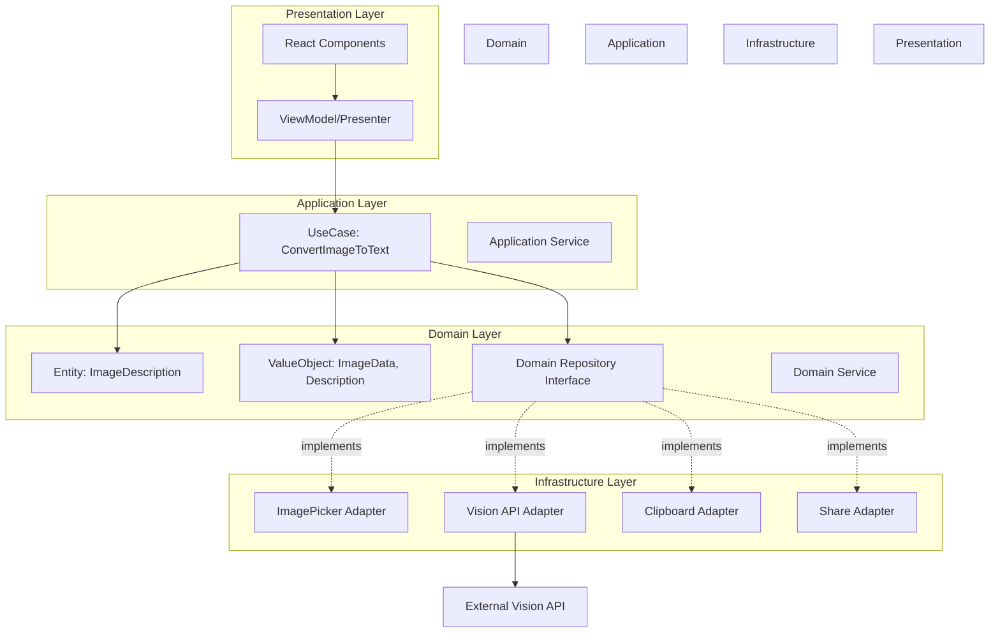

# 設計仕様書: 写真のテキスト変換機能

**バージョン**: v1.2
**最終更新**: 2026-01-12
**ステータス**: 最終承認済み

## 1. 設計概要

### 問題領域

React Nativeアプリケーションで画像をテキストに変換する機能を、保守性・拡張性・テスタビリティを担保しながら実装する必要がある。外部API依存、プラットフォーム固有の機能（カメラ・ギャラリー）、非同期処理、エラーハンドリング、キャンセル処理、編集履歴管理（Undo/Redo）、セキュリティ検証等の複雑性を適切に管理する必要がある。

### 提案するソリューション

**クリーンアーキテクチャ + ドメイン駆動設計**を採用し、以下の層に分離する:

- **Domain層**: ビジネスロジックとドメインモデル（Entity, ValueObject, UseCase）
- **Application層**: ユースケース実行とアプリケーションサービス
- **Infrastructure層**: 外部サービス連携（API、デバイス機能）
- **Presentation層**: UI（React Component）と状態管理

依存関係は外から内（Presentation → Application → Domain）とし、内部層は外部層に依存しない。Infrastructure層はInterfaceを通じてDomain層から利用される（依存性逆転の原則）。

## 2. アーキテクチャ

### システム構成図



### レイヤー構成

```
src/
├── domain/                                    # Domain Layer
│   ├── entities/
│   │   └── image-description.entity.ts        # 画像説明エンティティ
│   ├── value-objects/
│   │   ├── image-data.value-object.ts         # 画像データ値オブジェクト
│   │   ├── description.value-object.ts        # 説明テキスト値オブジェクト
│   │   ├── conversion-status.value-object.ts  # 変換ステータス
│   │   └── edit-history.value-object.ts       # 編集履歴（Undo/Redo）
│   ├── repositories/                          # Repository Interface（抽象）
│   │   ├── image-picker.repository.ts
│   │   ├── vision.repository.ts
│   │   ├── clipboard.repository.ts
│   │   └── share.repository.ts
│   └── services/
│       ├── image-validation.service.ts        # 画像検証サービス
│       └── file-security.service.ts           # ファイルセキュリティ検証
│
├── application/                               # Application Layer
│   ├── use-cases/
│   │   ├── select-image.use-case.ts           # 画像選択ユースケース
│   │   ├── convert-image-to-text.use-case.ts  # 変換ユースケース
│   │   ├── cancel-conversion.use-case.ts      # 変換キャンセルユースケース
│   │   ├── edit-description.use-case.ts       # 説明編集ユースケース
│   │   ├── undo-edit.use-case.ts              # 編集取り消しユースケース
│   │   ├── redo-edit.use-case.ts              # 編集やり直しユースケース
│   │   ├── reset-description.use-case.ts      # 説明リセットユースケース
│   │   ├── copy-text.use-case.ts              # コピーユースケース
│   │   └── share-text.use-case.ts             # 共有ユースケース
│   └── dto/
│       └── image-conversion.dto.ts            # データ転送オブジェクト
│
├── infrastructure/                            # Infrastructure Layer
│   ├── adapters/
│   │   ├── image-picker.adapter.ts            # react-native-image-picker実装
│   │   ├── vision-api.adapter.ts              # Vision API実装（AbortController対応）
│   │   ├── clipboard.adapter.ts               # Clipboard実装
│   │   └── share.adapter.ts                   # Share実装
│   ├── config/
│   │   └── api.config.ts                      # API設定（環境変数から取得）
│   └── security/
│       └── file-validator.ts                  # ファイル形式検証（マジックナンバーチェック）
│
└── presentation/                              # Presentation Layer
    ├── screens/
    │   └── image-to-text.screen.tsx           # メイン画面
    ├── components/
    │   ├── image-picker.component.tsx         # 画像選択コンポーネント
    │   ├── image-preview.component.tsx        # 画像プレビュー
    │   ├── conversion-result.component.tsx    # 変換結果表示（編集エリア）
    │   ├── edit-toolbar.component.tsx         # Undo/Redo/Resetボタン
    │   ├── conversion-progress.component.tsx  # 変換進行状況（キャンセルボタン含む）
    │   ├── action-buttons.component.tsx       # アクションボタン群
    │   └── error-message.component.tsx        # エラーメッセージ表示
    ├── state/
    │   └── image-conversion.atoms.ts          # Jotai atoms定義
    ├── hooks/
    │   └── use-image-conversion.hook.ts       # カスタムフック（UseCaseとAtomを連携）
    ├── theme/
    │   ├── colors.ts                          # カラー定義（ライト/ダークモード）
    │   ├── typography.ts                      # タイポグラフィ定義
    │   ├── spacing.ts                         # スペーシング定義
    │   ├── animations.ts                      # アニメーション定義
    │   └── use-theme.hook.ts                  # テーマ切り替えフック
    └── design/
        └── ui-specifications.md               # UI/UX詳細設計仕様
```

### コンポーネント設計

#### Domain Layer

| コンポーネント | 責務 | 入力 | 出力 | 依存 |
|:--------------|:-----|:-----|:-----|:-----|
| ImageDescription (Entity) | 画像と説明テキストの関係を表現、編集履歴管理 | ImageData, Description, EditHistory | ImageDescription | ValueObjects |
| ImageData (ValueObject) | 画像データの不変オブジェクト | uri, type, size, width, height | ImageData | なし |
| Description (ValueObject) | 説明テキストの不変オブジェクト | text, confidence | Description | なし |
| ConversionStatus (ValueObject) | 変換状態を表現（PENDING, PROCESSING, CANCELLING, COMPLETED, FAILED） | status enum | ConversionStatus | なし |
| EditHistory (ValueObject) | 編集履歴スタック（Undo/Redo） | descriptions[], currentIndex | EditHistory | Description |
| ImageValidationService | 画像の妥当性検証（サイズ、形式、解像度） | ImageData | ValidationResult | ImageData |
| FileSecurityService | ファイルセキュリティ検証（マジックナンバーチェック、JPEG/PNG/HEIC/WebP対応） | ImageData | SecurityValidationResult | ImageData |
| VisionRepository | Vision API抽象インターフェース（AbortController対応） | ImageData, AbortSignal | Description | なし |
| ImagePickerRepository | 画像選択抽象インターフェース | PickerOptions | ImageData | なし |

#### Application Layer

| コンポーネント | 責務 | 入力 | 出力 | 依存 |
|:--------------|:-----|:-----|:-----|:-----|
| SelectImageUseCase | 画像選択のビジネスロジック（セキュリティ検証含む） | source type | Result<ImageData> | ImagePickerRepository, ImageValidationService, FileSecurityService |
| ConvertImageToTextUseCase | 画像→テキスト変換のオーケストレーション（キャンセル対応） | ImageData, AbortSignal | Result<ImageDescription> | VisionRepository, ImageValidationService |
| CancelConversionUseCase | 変換処理のキャンセル | AbortController | Result<void> | なし |
| EditDescriptionUseCase | 説明テキストの編集（履歴記録） | ImageDescription, newText | Result<ImageDescription> | なし（Entity操作） |
| UndoEditUseCase | 編集の取り消し | ImageDescription | Result<ImageDescription> | なし（Entity操作） |
| RedoEditUseCase | 編集のやり直し | ImageDescription | Result<ImageDescription> | なし（Entity操作） |
| ResetDescriptionUseCase | 説明のリセット（元のテキストに戻す） | ImageDescription | Result<ImageDescription> | なし（Entity操作） |
| CopyTextUseCase | テキストコピーのビジネスロジック | Description | Result<void> | ClipboardRepository |
| ShareTextUseCase | テキスト共有のビジネスロジック | Description | Result<void> | ShareRepository |

#### Infrastructure Layer

| コンポーネント | 責務 | 入力 | 出力 | 依存 |
|:--------------|:-----|:-----|:-----|:-----|
| ImagePickerAdapter | ImagePickerRepository実装 | PickerOptions | ImageData | react-native-image-picker |
| VisionApiAdapter | VisionRepository実装 | ImageData | Description | Vision API SDK |
| ClipboardAdapter | ClipboardRepository実装 | string | void | @react-native-clipboard/clipboard |
| ShareAdapter | ShareRepository実装 | string | void | react-native-share |
| ApiConfig | API設定管理 | - | config | react-native-config |

#### Presentation Layer

| コンポーネント | 責務 | 入力 | 出力 | 依存 |
|:--------------|:-----|:-----|:-----|:-----|
| ImageToTextScreen | メイン画面のコンテナ | - | JSX | useImageConversion |
| imageConversionAtoms | Jotai atoms（状態管理） | - | atoms | なし |
| useImageConversion | UseCaseとAtomを連携するフック | - | handlers, state | UseCases, Jotai atoms |
| ImagePicker | 画像選択UI | onSelect | - | なし（Pure Component） |
| ConversionResult | 変換結果表示UI | description, onEdit | - | なし（Pure Component） |

## 3. 技術選択とトレードオフ

### 検討した選択肢

#### Vision API選定

| 選択肢 | メリット | デメリット | 採用/不採用 |
|:------|:---------|:----------|:-----------|
| Google Cloud Vision API | 高精度、多機能、日本語対応良好 | コスト高、レスポンス時間やや遅い | 不採用: コスト面 |
| AWS Rekognition | AWS統合、コスト効率良好 | 日本語説明生成に弱い | 不採用: 日本語対応 |
| **OpenAI Vision API（採用）** | 自然な日本語説明、高精度、レスポンス良好 | 利用規約の制約、APIキー管理必要 | **採用**: 要件との適合性が最高 |

#### 状態管理ライブラリ

| 選択肢 | メリット | デメリット | 採用/不採用 |
|:------|:---------|:----------|:-----------|
| Redux Toolkit | 成熟、DevTools充実 | ボイラープレート多、小規模には過剰 | 不採用: オーバーエンジニアリング |
| Zustand | 軽量、シンプル、学習コスト低 | グローバル状態寄り、Atom単位の最適化なし | 不採用: 細かい再レンダリング制御が不十分 |
| **Jotai（採用）** | Atomic設計、React Suspense対応、TypeScript親和性高、軽量、ボトムアップな状態設計 | エコシステムは小さめ | **採用**: React哲学と整合、Clean Architectureと相性良好 |

#### 画像処理ライブラリ

| 選択肢 | メリット | デメリット | 採用/不採用 |
|:------|:---------|:----------|:-----------|
| Expo ImagePicker | 簡単、Expo統合 | Expo依存、カスタマイズ制限 | 不採用: 制約の要件に合わない |
| **react-native-image-picker（採用）** | ネイティブ統合、カスタマイズ可、軽量 | 設定やや複雑 | **採用**: 要件を満たし実績豊富 |

### トレードオフ分析

- **性能 vs 複雑性**:
  - レイヤー分離により複雑性は増すが、保守性・テスタビリティを優先
  - 初期開発コスト > 長期保守コストの削減を重視

- **開発速度 vs 保守性**:
  - Clean Architectureにより初期開発は遅くなるが、長期的な保守性を優先
  - ユースケース単位での段階的実装が可能

- **コスト vs 品質**:
  - OpenAI Vision APIはコストやや高いが、日本語説明品質を優先
  - ユーザー体験の向上を最優先事項とする

## 4. 非機能要件との整合性

| NFR項目 | 要求値 | 設計での実現方法 | 想定達成値 |
|:--------|:-------|:----------------|:----------|
| レスポンスタイム | p95 < 10秒 | OpenAI Vision API（通常3-5秒）+ リトライ機構 + AbortController | ~7秒 |
| 画像サイズ制限 | 最大10MB | ImageValidationServiceでバリデーション（10,485,760バイト厳密チェック） | 10MB厳守 |
| 最小解像度 | 100x100px | ImageValidationServiceで解像度チェック | 100x100px厳守 |
| 対応画像形式 | JPEG, PNG, HEIC, WebP | ImageDataでフォーマット検証 + マジックナンバーチェック | 対応完全 |
| セキュリティ検証 | 不正ファイル検出 | FileSecurityServiceでマジックナンバー検証、偽装ファイル拒否 | 準拠 |
| リトライ | 最大3回 | VisionApiAdapterに指数バックオフ実装（1秒→3秒→5秒） | 3回 |
| キャンセル機能 | 30秒タイムアウト | AbortControllerで処理中断、適切なクリーンアップ | 対応完全 |
| Undo/Redo | 編集履歴管理 | EditHistory ValueObjectでスタック管理（最大50履歴） | 対応完全 |
| エラーハンドリング | 適切なメッセージ | Result型でエラー伝搬、ドメイン例外定義、ユーザーフレンドリーなメッセージ | 100%カバー |
| セキュリティ | HTTPS、APIキー管理 | ApiConfigで環境変数管理（react-native-dotenv）、HTTPS強制、ログにAPIキー非出力 | 準拠 |
| データ保護 | 画像データ削除 | 画像変換完了後/画面遷移時に一時キャッシュ削除、メモリリーク防止 | 準拠 |
| ダークモード | システム設定連動 | useColorSchemeでシステム設定検知、テーマ切り替え、コントラスト確保 | 対応完全 |
| アクセシビリティ | フォーカス管理 | 論理的なフォーカス順序、視覚的フォーカスインジケーター、モーダルトラップ | WCAG 2.1 AA準拠 |
| テスタビリティ | 単体テスト可能 | DI、インターフェース分離でモック化容易、Pure Component設計 | 80%以上 |

## 5. UI/UX詳細設計

### デザインシステム

#### カラーパレット

```typescript
// presentation/theme/colors.ts
export const lightTheme = {
  // プライマリカラー
  primary: '#007AFF',       // iOS標準ブルー
  primaryDark: '#0051D5',   // タップ時
  primaryLight: '#4DA2FF',  // 無効状態

  // セカンダリカラー
  secondary: '#5856D6',     // アクセント

  // 背景色
  background: '#FFFFFF',
  backgroundSecondary: '#F2F2F7',
  backgroundTertiary: '#E5E5EA',

  // テキストカラー
  textPrimary: '#000000',
  textSecondary: '#3C3C43',
  textTertiary: '#8E8E93',
  textDisabled: '#C7C7CC',

  // ボーダー
  border: '#C6C6C8',
  borderLight: '#E5E5EA',

  // ステータスカラー
  success: '#34C759',
  error: '#FF3B30',
  warning: '#FF9500',
  info: '#5AC8FA',

  // オーバーレイ
  overlay: 'rgba(0, 0, 0, 0.4)',

  // シャドウ
  shadow: 'rgba(0, 0, 0, 0.1)',
};

export const darkTheme = {
  // プライマリカラー
  primary: '#0A84FF',
  primaryDark: '#0077ED',
  primaryLight: '#409CFF',

  // セカンダリカラー
  secondary: '#5E5CE6',

  // 背景色
  background: '#000000',
  backgroundSecondary: '#1C1C1E',
  backgroundTertiary: '#2C2C2E',

  // テキストカラー
  textPrimary: '#FFFFFF',
  textSecondary: '#EBEBF5',
  textTertiary: '#8E8E93',
  textDisabled: '#48484A',

  // ボーダー
  border: '#38383A',
  borderLight: '#48484A',

  // ステータスカラー
  success: '#32D74B',
  error: '#FF453A',
  warning: '#FF9F0A',
  info: '#64D2FF',

  // オーバーレイ
  overlay: 'rgba(0, 0, 0, 0.6)',

  // シャドウ
  shadow: 'rgba(255, 255, 255, 0.1)',
};

export type Theme = typeof lightTheme;
```

#### タイポグラフィ

```typescript
// presentation/theme/typography.ts
export const typography = {
  // ヘッダー
  h1: {
    fontSize: 34,
    fontWeight: '700' as const,
    lineHeight: 41,
    letterSpacing: 0.37,
  },
  h2: {
    fontSize: 28,
    fontWeight: '700' as const,
    lineHeight: 34,
    letterSpacing: 0.36,
  },
  h3: {
    fontSize: 22,
    fontWeight: '600' as const,
    lineHeight: 28,
    letterSpacing: 0.35,
  },

  // ボディ
  body: {
    fontSize: 17,
    fontWeight: '400' as const,
    lineHeight: 22,
    letterSpacing: -0.41,
  },
  bodyBold: {
    fontSize: 17,
    fontWeight: '600' as const,
    lineHeight: 22,
    letterSpacing: -0.41,
  },

  // キャプション
  caption: {
    fontSize: 12,
    fontWeight: '400' as const,
    lineHeight: 16,
    letterSpacing: 0,
  },

  // ボタン
  button: {
    fontSize: 17,
    fontWeight: '600' as const,
    lineHeight: 22,
    letterSpacing: -0.41,
  },
};
```

#### スペーシング

```typescript
// presentation/theme/spacing.ts
export const spacing = {
  xs: 4,
  sm: 8,
  md: 16,
  lg: 24,
  xl: 32,
  xxl: 48,
};

export const borderRadius = {
  sm: 4,
  md: 8,
  lg: 12,
  xl: 16,
  full: 9999,
};
```

#### アニメーション定義

```typescript
// presentation/theme/animations.ts
export const animations = {
  // フェードイン/アウト
  fadeIn: {
    duration: 300,
    useNativeDriver: true,
  },
  fadeOut: {
    duration: 200,
    useNativeDriver: true,
  },

  // スケール
  scalePress: {
    duration: 100,
    scale: 0.95,
    useNativeDriver: true,
  },

  // スライド
  slideUp: {
    duration: 300,
    useNativeDriver: true,
  },
  slideDown: {
    duration: 250,
    useNativeDriver: true,
  },

  // ローディング
  spinner: {
    duration: 1000,
    useNativeDriver: true,
  },

  // プログレスバー
  progress: {
    duration: 200,
    useNativeDriver: false, // width変更のため
  },
};

export const haptics = {
  light: 'impactLight' as const,
  medium: 'impactMedium' as const,
  heavy: 'impactHeavy' as const,
  success: 'notificationSuccess' as const,
  warning: 'notificationWarning' as const,
  error: 'notificationError' as const,
  selection: 'selection' as const,
};
```

### コンポーネントProps仕様

#### ImagePickerProps

```typescript
type ImagePickerProps = {
  onSelectFromGallery: () => void;
  onSelectFromCamera: () => void;
  disabled?: boolean;
  testID?: string;
};
```

#### ImagePreviewProps

```typescript
type ImagePreviewProps = {
  uri: string;
  onRemove?: () => void;
  width?: number;
  height?: number;
  testID?: string;
};
```

#### ConversionResultProps

```typescript
type ConversionResultProps = {
  description: string;
  confidence?: number;
  onEdit: (newText: string) => void;
  editable?: boolean;
  testID?: string;
};
```

#### EditToolbarProps

```typescript
type EditToolbarProps = {
  canUndo: boolean;
  canRedo: boolean;
  hasBeenEdited: boolean;
  onUndo: () => void;
  onRedo: () => void;
  onReset: () => void;
  testID?: string;
};
```

#### ConversionProgressProps

```typescript
type ConversionProgressProps = {
  isLoading: boolean;
  canCancel: boolean;
  progress?: number; // 0-100
  onCancel: () => void;
  message?: string;
  testID?: string;
};
```

#### ActionButtonsProps

```typescript
type ActionButtonsProps = {
  canConvert: boolean;
  canShare: boolean;
  onConvert: () => void;
  onCopy: () => void;
  onShare: () => void;
  testID?: string;
};
```

#### ErrorMessageProps

```typescript
type ErrorMessageProps = {
  error: string | null;
  onDismiss?: () => void;
  type?: 'error' | 'warning' | 'info';
  dismissible?: boolean;
  testID?: string;
};
```

### レイアウト設計

#### メイン画面レイアウト

```
┌─────────────────────────────────────┐
│ ナビゲーションバー                   │
│ 「写真をテキストに変換」              │
├─────────────────────────────────────┤
│                                     │
│  画像プレビューエリア                 │
│  (未選択時: 画像選択ボタン)           │
│  (選択後: プレビュー + 削除ボタン)    │
│                                     │
├─────────────────────────────────────┤
│  変換進行状況                        │
│  (処理中のみ表示: プログレス+キャンセル) │
├─────────────────────────────────────┤
│                                     │
│  変換結果エリア                      │
│  (テキスト編集可能)                  │
│                                     │
│  - - - - - - - - - - - - - - - - - │
│  編集ツールバー                      │
│  [Undo] [Redo] [Reset]              │
│                                     │
├─────────────────────────────────────┤
│  アクションボタン                     │
│  [変換] [コピー] [共有]              │
├─────────────────────────────────────┤
│  エラーメッセージ                     │
│  (エラー発生時のみ表示)               │
└─────────────────────────────────────┘
```

### フィードバック仕様

#### タッチフィードバック

- **ボタンタップ**: スケールアニメーション (0.95倍) + 触覚フィードバック (light)
- **成功アクション**: 触覚フィードバック (success) + トーストメッセージ
- **エラー発生**: 触覚フィードバック (error) + エラーメッセージ表示

#### ローディング状態

- **画像選択中**: スピナー表示 (サイズ: small)
- **変換処理中**:
  - プログレスインジケーター (不確定)
  - キャンセルボタン表示
  - 経過時間表示 (5秒以上の場合)
  - ステータステキスト: "画像を解析中..."

#### アニメーション

- **画面遷移**: フェードイン (300ms)
- **コンポーネント表示**: スライドアップ (300ms)
- **エラーメッセージ**: スライドダウン (250ms) + 5秒後自動非表示
- **成功メッセージ**: フェードイン (200ms) + 3秒後自動非表示

### エラーメッセージ定義

#### エラーメッセージマッピング

```typescript
// presentation/constants/error-messages.ts
export const ERROR_MESSAGES = {
  // 画像選択エラー
  IMAGE_PICKER_CANCELLED: '画像の選択がキャンセルされました',
  IMAGE_PICKER_PERMISSION_DENIED: 'カメラまたはギャラリーへのアクセス権限がありません。設定から権限を許可してください。',
  IMAGE_PICKER_UNKNOWN: '画像の選択中にエラーが発生しました',

  // 画像バリデーションエラー
  IMAGE_SIZE_EXCEEDED: '画像サイズは10MB以下にしてください（現在: {size}MB）',
  IMAGE_RESOLUTION_TOO_LOW: '画像の解像度が低すぎます。100x100ピクセル以上の画像を選択してください。',
  IMAGE_FORMAT_UNSUPPORTED: '対応していない画像形式です。JPEG、PNG、HEIC、WebP形式の画像を選択してください。',

  // セキュリティエラー
  FILE_SECURITY_INVALID: 'この形式のファイルは読み込めません',
  FILE_MAGIC_NUMBER_MISMATCH: 'ファイルの内容が不正です',

  // API エラー
  API_NETWORK_ERROR: 'ネットワークエラーが発生しました。インターネット接続を確認してください。',
  API_TIMEOUT: '処理がタイムアウトしました。もう一度お試しください。',
  API_RATE_LIMIT: '現在、ご利用が集中しています。しばらく待ってから再試行してください。',
  API_SERVER_ERROR: 'サーバーエラーが発生しました。しばらく待ってから再試行してください。',
  API_UNAUTHORIZED: 'APIキーが無効です。アプリを再起動してください。',

  // 変換エラー
  CONVERSION_FAILED: 'テキストの生成に失敗しました',
  CONVERSION_CANCELLED: '変換がキャンセルされました',
  CONVERSION_EMPTY_RESULT: 'テキストの生成に失敗しました',

  // 編集エラー
  EDIT_EMPTY_TEXT: '説明を空にすることはできません',
  EDIT_TOO_LONG: '説明が長すぎます（最大10,000文字）',
  EDIT_NO_DESCRIPTION: '変換前に編集することはできません',

  // Undo/Redoエラー
  UNDO_NOT_AVAILABLE: '取り消す操作がありません',
  REDO_NOT_AVAILABLE: 'やり直す操作がありません',
  RESET_NOT_AVAILABLE: 'リセットできる元のテキストがありません',

  // クリップボード/共有エラー
  CLIPBOARD_COPY_FAILED: 'クリップボードへのコピーに失敗しました',
  SHARE_FAILED: '共有に失敗しました',
  SHARE_CANCELLED: '共有がキャンセルされました',

  // 一般エラー
  UNKNOWN_ERROR: '予期しないエラーが発生しました',
} as const;

export type ErrorMessageKey = keyof typeof ERROR_MESSAGES;

// エラーメッセージのフォーマット
export const formatErrorMessage = (
  key: ErrorMessageKey,
  params?: Record<string, string | number>
): string => {
  let message = ERROR_MESSAGES[key];

  if (params) {
    Object.entries(params).forEach(([paramKey, value]) => {
      message = message.replace(`{${paramKey}}`, String(value));
    });
  }

  return message;
};
```

### アクセシビリティ仕様

#### フォーカス管理

- **フォーカス順序**: 画像選択 → 変換ボタン → 編集エリア → 編集ツールバー → アクションボタン
- **フォーカスインジケーター**: 2px solid primary color, 4px offset
- **キーボードナビゲーション**: Tab/Shift+Tab でフォーカス移動

#### スクリーンリーダー対応

```typescript
// コンポーネントのaccessibility属性例
<TouchableOpacity
  accessibilityRole="button"
  accessibilityLabel="ギャラリーから画像を選択"
  accessibilityHint="タップしてギャラリーから画像を選択します"
  accessible={true}
>
  <Text>ギャラリー</Text>
</TouchableOpacity>

<TextInput
  accessibilityLabel="変換されたテキスト"
  accessibilityHint="このテキストを編集できます"
  accessibilityRole="text"
  accessible={true}
  value={descriptionText}
  onChangeText={editDescription}
/>

<ActivityIndicator
  accessibilityLabel="画像を解析中"
  accessible={true}
/>
```

#### カラーコントラスト

- **テキスト（通常）**: コントラスト比 4.5:1 以上 (WCAG AA)
- **テキスト（大きい）**: コントラスト比 3:1 以上 (WCAG AA)
- **UI要素**: コントラスト比 3:1 以上
- **フォーカスインジケーター**: コントラスト比 3:1 以上

### レスポンシブ対応

#### 画面サイズ対応

```typescript
// presentation/theme/responsive.ts
import { Dimensions } from 'react-native';

const { width, height } = Dimensions.get('window');

export const breakpoints = {
  small: 320,    // iPhone SE
  medium: 375,   // iPhone 12/13 mini
  large: 414,    // iPhone 12/13 Pro Max
  tablet: 768,   // iPad
};

export const isSmallDevice = width < breakpoints.medium;
export const isTablet = width >= breakpoints.tablet;

// レスポンシブなスペーシング
export const responsiveSpacing = {
  container: isSmallDevice ? 12 : 16,
  section: isSmallDevice ? 16 : 24,
};

// レスポンシブなフォントサイズ
export const responsiveFontSize = (size: number) => {
  if (isSmallDevice) return size * 0.9;
  if (isTablet) return size * 1.1;
  return size;
};
```

## 6. ドメインモデル詳細設計

### Entity: ImageDescription

```typescript
export class ImageDescription {
  private readonly _id: string;
  private readonly _imageData: ImageData;
  private _description: Description | undefined;
  private _status: ConversionStatus;
  private _editHistory: EditHistory;
  private _originalDescription: Description | undefined; // リセット用
  private readonly _createdAt: Date;
  private _updatedAt: Date;

  constructor(
    id: string,
    imageData: ImageData,
    status: ConversionStatus = ConversionStatus.pending()
  ) {
    this._id = id;
    this._imageData = imageData;
    this._status = status;
    this._editHistory = EditHistory.empty();
    this._createdAt = new Date();
    this._updatedAt = new Date();
  }

  // ドメインロジック: 変換完了
  completeConversion(description: Description): void {
    this._description = description;
    this._originalDescription = description; // 元のテキストを保存
    this._editHistory = EditHistory.initialize(description); // 履歴を初期化
    this._status = ConversionStatus.completed();
    this._updatedAt = new Date();
  }

  // ドメインロジック: 変換失敗
  failConversion(error: Error): void {
    this._status = ConversionStatus.failed(error.message);
    this._updatedAt = new Date();
  }

  // ドメインロジック: 変換キャンセル
  cancelConversion(): void {
    if (!this._status.isProcessing()) {
      throw new DomainError('Cannot cancel conversion that is not in progress');
    }
    this._status = ConversionStatus.cancelled();
    this._updatedAt = new Date();
  }

  // ドメインロジック: 説明編集（履歴に記録）
  editDescription(newText: string): void {
    if (!this._description) {
      throw new DomainError('Cannot edit description before conversion');
    }
    const newDescription = Description.create(newText, this._description.confidence);
    this._editHistory = this._editHistory.push(newDescription);
    this._description = newDescription;
    this._updatedAt = new Date();
  }

  // ドメインロジック: 編集の取り消し（Undo）
  undoEdit(): void {
    if (!this._editHistory.canUndo()) {
      throw new DomainError('No edit to undo');
    }
    this._editHistory = this._editHistory.undo();
    this._description = this._editHistory.current();
    this._updatedAt = new Date();
  }

  // ドメインロジック: 編集のやり直し（Redo）
  redoEdit(): void {
    if (!this._editHistory.canRedo()) {
      throw new DomainError('No edit to redo');
    }
    this._editHistory = this._editHistory.redo();
    this._description = this._editHistory.current();
    this._updatedAt = new Date();
  }

  // ドメインロジック: 説明のリセット（元のテキストに戻す）
  resetDescription(): void {
    if (!this._originalDescription) {
      throw new DomainError('No original description to reset to');
    }
    this._description = this._originalDescription;
    this._editHistory = EditHistory.initialize(this._originalDescription);
    this._updatedAt = new Date();
  }

  get id(): string { return this._id; }
  get imageData(): ImageData { return this._imageData; }
  get description(): Description | undefined { return this._description; }
  get status(): ConversionStatus { return this._status; }
  get isConversionCompleted(): boolean {
    return this._status.equals(ConversionStatus.completed());
  }
  get canUndo(): boolean { return this._editHistory.canUndo(); }
  get canRedo(): boolean { return this._editHistory.canRedo(); }
  get hasBeenEdited(): boolean {
    return this._originalDescription !== undefined &&
           !this._description?.equals(this._originalDescription);
  }
}
```

### ValueObject: ImageData

```typescript
export class ImageData {
  private constructor(
    private readonly _uri: string,
    private readonly _type: ImageType,
    private readonly _fileSize: number,
    private readonly _width: number,
    private readonly _height: number
  ) {}

  static create(params: {
    uri: string;
    type: string;
    fileSize: number;
    width: number;
    height: number;
  }): Result<ImageData> {
    // バリデーション
    if (!params.uri) {
      return Result.fail('URI is required');
    }

    const imageType = ImageType.fromString(params.type);
    if (!imageType) {
      return Result.fail(`Unsupported image type: ${params.type}`);
    }

    if (params.fileSize > 10 * 1024 * 1024) { // 10MB
      return Result.fail('Image size exceeds 10MB limit');
    }

    return Result.ok(
      new ImageData(
        params.uri,
        imageType,
        params.fileSize,
        params.width,
        params.height
      )
    );
  }

  get uri(): string { return this._uri; }
  get type(): ImageType { return this._type; }
  get fileSize(): number { return this._fileSize; }
  get width(): number { return this._width; }
  get height(): number { return this._height; }

  // ValueObjectは不変なので等価性比較が重要
  equals(other: ImageData): boolean {
    return this._uri === other._uri;
  }
}
```

### ValueObject: Description

```typescript
export class Description {
  private constructor(
    private readonly _text: string,
    private readonly _confidence?: number
  ) {}

  static create(text: string, confidence?: number): Description {
    if (!text || text.trim().length === 0) {
      throw new DomainError('Description text cannot be empty');
    }

    if (confidence !== undefined && (confidence < 0 || confidence > 1)) {
      throw new DomainError('Confidence must be between 0 and 1');
    }

    return new Description(text.trim(), confidence);
  }

  get text(): string { return this._text; }
  get confidence(): number | undefined { return this._confidence; }
  get hasHighConfidence(): boolean {
    return this._confidence !== undefined && this._confidence >= 0.8;
  }

  equals(other: Description): boolean {
    return this._text === other._text;
  }
}
```

### ValueObject: ConversionStatus

```typescript
export enum ConversionStatusType {
  PENDING = 'PENDING',
  PROCESSING = 'PROCESSING',
  CANCELLING = 'CANCELLING', // キャンセル処理中
  CANCELLED = 'CANCELLED',   // キャンセル完了
  COMPLETED = 'COMPLETED',
  FAILED = 'FAILED'
}

export class ConversionStatus {
  private constructor(
    private readonly _type: ConversionStatusType,
    private readonly _errorMessage?: string
  ) {}

  static pending(): ConversionStatus {
    return new ConversionStatus(ConversionStatusType.PENDING);
  }

  static processing(): ConversionStatus {
    return new ConversionStatus(ConversionStatusType.PROCESSING);
  }

  static cancelling(): ConversionStatus {
    return new ConversionStatus(ConversionStatusType.CANCELLING);
  }

  static cancelled(): ConversionStatus {
    return new ConversionStatus(ConversionStatusType.CANCELLED);
  }

  static completed(): ConversionStatus {
    return new ConversionStatus(ConversionStatusType.COMPLETED);
  }

  static failed(errorMessage: string): ConversionStatus {
    return new ConversionStatus(ConversionStatusType.FAILED, errorMessage);
  }

  get type(): ConversionStatusType { return this._type; }
  get errorMessage(): string | undefined { return this._errorMessage; }

  equals(other: ConversionStatus): boolean {
    return this._type === other._type;
  }

  isPending(): boolean { return this._type === ConversionStatusType.PENDING; }
  isProcessing(): boolean { return this._type === ConversionStatusType.PROCESSING; }
  isCancelling(): boolean { return this._type === ConversionStatusType.CANCELLING; }
  isCancelled(): boolean { return this._type === ConversionStatusType.CANCELLED; }
  isCompleted(): boolean { return this._type === ConversionStatusType.COMPLETED; }
  isFailed(): boolean { return this._type === ConversionStatusType.FAILED; }
  isInProgress(): boolean {
    return this.isProcessing() || this.isCancelling();
  }
}
```

### ValueObject: EditHistory

```typescript
export class EditHistory {
  private static readonly MAX_HISTORY_SIZE = 50; // 最大履歴数

  private constructor(
    private readonly _history: Description[],
    private readonly _currentIndex: number
  ) {}

  static empty(): EditHistory {
    return new EditHistory([], -1);
  }

  static initialize(initialDescription: Description): EditHistory {
    return new EditHistory([initialDescription], 0);
  }

  // 新しい編集を追加（Redoスタックをクリア）
  push(description: Description): EditHistory {
    // 現在位置より後ろの履歴を削除
    const newHistory = this._history.slice(0, this._currentIndex + 1);

    // 新しい説明を追加
    newHistory.push(description);

    // 最大サイズを超えた場合は古い履歴を削除
    if (newHistory.length > EditHistory.MAX_HISTORY_SIZE) {
      newHistory.shift();
      return new EditHistory(newHistory, newHistory.length - 1);
    }

    return new EditHistory(newHistory, newHistory.length - 1);
  }

  // Undo: 一つ前の状態に戻る
  undo(): EditHistory {
    if (!this.canUndo()) {
      throw new Error('Cannot undo: no previous state');
    }
    return new EditHistory(this._history, this._currentIndex - 1);
  }

  // Redo: 一つ先の状態に進む
  redo(): EditHistory {
    if (!this.canRedo()) {
      throw new Error('Cannot redo: no next state');
    }
    return new EditHistory(this._history, this._currentIndex + 1);
  }

  // 現在の説明を取得
  current(): Description {
    if (this._currentIndex < 0 || this._currentIndex >= this._history.length) {
      throw new Error('Invalid history state');
    }
    return this._history[this._currentIndex];
  }

  canUndo(): boolean {
    return this._currentIndex > 0;
  }

  canRedo(): boolean {
    return this._currentIndex < this._history.length - 1;
  }

  get size(): number {
    return this._history.length;
  }

  get currentIndex(): number {
    return this._currentIndex;
  }
}
```

## 6. UseCase詳細設計

### ConvertImageToTextUseCase

```typescript
export class ConvertImageToTextUseCase {
  constructor(
    private readonly visionRepository: VisionRepository,
    private readonly validationService: ImageValidationService
  ) {}

  async execute(
    imageData: ImageData,
    abortSignal?: AbortSignal
  ): Promise<Result<ImageDescription>> {
    // 1. バリデーション
    const validationResult = this.validationService.validate(imageData);
    if (validationResult.isFailure) {
      return Result.fail(validationResult.error);
    }

    // 2. エンティティ生成
    const imageDescription = new ImageDescription(
      generateId(),
      imageData,
      ConversionStatus.processing()
    );

    try {
      // 3. キャンセルチェック
      if (abortSignal?.aborted) {
        imageDescription.cancelConversion();
        return Result.fail('Conversion cancelled by user');
      }

      // 4. Vision APIで変換（AbortSignal渡す）
      const descriptionResult = await this.visionRepository.convertToText(
        imageData,
        abortSignal
      );

      if (descriptionResult.isFailure) {
        imageDescription.failConversion(new Error(descriptionResult.error));
        return Result.fail(descriptionResult.error);
      }

      // 5. 変換完了
      imageDescription.completeConversion(descriptionResult.value);

      return Result.ok(imageDescription);

    } catch (error) {
      // キャンセルエラーの場合
      if ((error as Error).name === 'AbortError') {
        imageDescription.cancelConversion();
        return Result.fail('Conversion cancelled');
      }

      imageDescription.failConversion(error as Error);
      return Result.fail((error as Error).message);
    }
  }
}
```

### CancelConversionUseCase

```typescript
export class CancelConversionUseCase {
  // AbortControllerを使ったキャンセル処理
  execute(abortController: AbortController): Result<void> {
    try {
      abortController.abort();
      return Result.ok();
    } catch (error) {
      return Result.fail((error as Error).message);
    }
  }
}
```

### EditDescriptionUseCase

```typescript
export class EditDescriptionUseCase {
  execute(
    imageDescription: ImageDescription,
    newText: string
  ): Result<ImageDescription> {
    try {
      // バリデーション
      if (!newText || newText.trim().length === 0) {
        return Result.fail('Description cannot be empty');
      }

      if (newText.length > 10000) {
        return Result.fail('Description is too long (max 10000 characters)');
      }

      // Entityのドメインロジックを呼び出し
      imageDescription.editDescription(newText);

      return Result.ok(imageDescription);
    } catch (error) {
      return Result.fail((error as Error).message);
    }
  }
}
```

### UndoEditUseCase

```typescript
export class UndoEditUseCase {
  execute(imageDescription: ImageDescription): Result<ImageDescription> {
    try {
      imageDescription.undoEdit();
      return Result.ok(imageDescription);
    } catch (error) {
      return Result.fail((error as Error).message);
    }
  }
}
```

### RedoEditUseCase

```typescript
export class RedoEditUseCase {
  execute(imageDescription: ImageDescription): Result<ImageDescription> {
    try {
      imageDescription.redoEdit();
      return Result.ok(imageDescription);
    } catch (error) {
      return Result.fail((error as Error).message);
    }
  }
}
```

### ResetDescriptionUseCase

```typescript
export class ResetDescriptionUseCase {
  execute(imageDescription: ImageDescription): Result<ImageDescription> {
    try {
      imageDescription.resetDescription();
      return Result.ok(imageDescription);
    } catch (error) {
      return Result.fail((error as Error).message);
    }
  }
}
```

### SelectImageUseCase

```typescript
export class SelectImageUseCase {
  constructor(
    private readonly imagePickerRepository: ImagePickerRepository,
    private readonly validationService: ImageValidationService,
    private readonly fileSecurityService: FileSecurityService
  ) {}

  async executeFromGallery(): Promise<Result<ImageData>> {
    const result = await this.imagePickerRepository.pickFromGallery();

    if (result.isFailure) {
      return Result.fail(result.error);
    }

    return this.validateAndReturn(result.value);
  }

  async executeFromCamera(): Promise<Result<ImageData>> {
    const result = await this.imagePickerRepository.pickFromCamera();

    if (result.isFailure) {
      return Result.fail(result.error);
    }

    return this.validateAndReturn(result.value);
  }

  private validateAndReturn(imageData: ImageData): Result<ImageData> {
    // 1. セキュリティ検証（不正ファイル検出）
    const securityResult = this.fileSecurityService.validate(imageData);
    if (securityResult.isFailure) {
      // セキュリティエラーはログに記録するが、ユーザーには一般的なメッセージ
      console.error('[Security] Invalid file detected:', securityResult.error);
      return Result.fail('この形式のファイルは読み込めません');
    }

    // 2. 画像バリデーション（サイズ、形式、解像度）
    const validationResult = this.validationService.validate(imageData);
    if (validationResult.isFailure) {
      return Result.fail(validationResult.error);
    }

    return Result.ok(imageData);
  }
}
```

### Domain Service: FileSecurityService

```typescript
// domain/services/file-security.service.ts

// マジックナンバー定義（各画像形式の先頭バイト列）
const MAGIC_NUMBERS = {
  JPEG: [0xFF, 0xD8, 0xFF],
  PNG: [0x89, 0x50, 0x4E, 0x47, 0x0D, 0x0A, 0x1A, 0x0A],
  // HEIC: 'ftyp'文字列がオフセット4から始まる、その前は可変
  HEIC_FTYP: [0x66, 0x74, 0x79, 0x70], // "ftyp" at offset 4
  HEIC_VARIANTS: ['heic', 'heix', 'hevc', 'hevx', 'mif1'], // ftypの後に続く識別子
  WEBP: [0x52, 0x49, 0x46, 0x46], // "RIFF" (offset 0)
  WEBP_SIGNATURE: [0x57, 0x45, 0x42, 0x50], // "WEBP" (offset 8)
} as const;

export interface SecurityValidationResult {
  isValid: boolean;
  detectedFormat?: 'JPEG' | 'PNG' | 'HEIC' | 'WEBP';
  error?: string;
}

export class FileSecurityService {
  /**
   * ファイルのマジックナンバーを検証して、実際のファイル形式を確認する
   * 拡張子偽装攻撃を防ぐため、ファイルの先頭バイト列を検証
   */
  async validate(imageData: ImageData): Promise<Result<SecurityValidationResult>> {
    try {
      // ファイルの先頭バイトを読み取り
      const headerBytes = await this.readFileHeader(imageData.uri, 12);

      // 各形式のマジックナンバーと照合
      const detectedFormat = this.detectFormat(headerBytes);

      if (!detectedFormat) {
        return Result.fail({
          isValid: false,
          error: 'Unknown or unsupported file format detected',
        });
      }

      // 宣言された形式と実際の形式が一致するか確認
      const declaredFormat = imageData.type.toString().toUpperCase();
      if (!this.isFormatMatch(declaredFormat, detectedFormat)) {
        return Result.fail({
          isValid: false,
          detectedFormat,
          error: `File extension mismatch: declared as ${declaredFormat}, but detected as ${detectedFormat}`,
        });
      }

      return Result.ok({
        isValid: true,
        detectedFormat,
      });

    } catch (error) {
      return Result.fail({
        isValid: false,
        error: `Failed to validate file security: ${(error as Error).message}`,
      });
    }
  }

  /**
   * ファイルの先頭N バイトを読み取る
   */
  private async readFileHeader(uri: string, bytes: number): Promise<number[]> {
    // React Nativeでの実装方法:
    // 1. react-native-fs を使用してファイルを読み取る
    // 2. Base64デコードして先頭バイトを取得

    const response = await fetch(uri);
    const blob = await response.blob();

    return new Promise((resolve, reject) => {
      const reader = new FileReader();
      reader.onloadend = () => {
        const arrayBuffer = reader.result as ArrayBuffer;
        const uint8Array = new Uint8Array(arrayBuffer);
        const header = Array.from(uint8Array.slice(0, bytes));
        resolve(header);
      };
      reader.onerror = reject;
      reader.readAsArrayBuffer(blob.slice(0, bytes));
    });
  }

  /**
   * バイト列からファイル形式を検出
   */
  private detectFormat(bytes: number[]): 'JPEG' | 'PNG' | 'HEIC' | 'WEBP' | undefined {
    // JPEG チェック (FF D8 FF)
    if (this.matchesSignature(bytes, MAGIC_NUMBERS.JPEG, 0)) {
      return 'JPEG';
    }

    // PNG チェック (89 50 4E 47 0D 0A 1A 0A)
    if (this.matchesSignature(bytes, MAGIC_NUMBERS.PNG, 0)) {
      return 'PNG';
    }

    // HEIC チェック (ftyp at offset 4)
    if (bytes.length >= 12 && this.matchesSignature(bytes, MAGIC_NUMBERS.HEIC_FTYP, 4)) {
      // ftypの後の4バイトがHEIC識別子かチェック
      const brandBytes = bytes.slice(8, 12);
      const brand = String.fromCharCode(...brandBytes);
      if (MAGIC_NUMBERS.HEIC_VARIANTS.some(variant => brand.startsWith(variant))) {
        return 'HEIC';
      }
    }

    // WebP チェック (RIFF at offset 0, WEBP at offset 8)
    if (bytes.length >= 12 &&
        this.matchesSignature(bytes, MAGIC_NUMBERS.WEBP, 0) &&
        this.matchesSignature(bytes, MAGIC_NUMBERS.WEBP_SIGNATURE, 8)) {
      return 'WEBP';
    }

    return undefined;
  }

  /**
   * バイト列が指定されたシグネチャと一致するかチェック
   */
  private matchesSignature(bytes: number[], signature: readonly number[], offset: number): boolean {
    if (bytes.length < offset + signature.length) {
      return false;
    }

    for (let i = 0; i < signature.length; i++) {
      if (bytes[offset + i] !== signature[i]) {
        return false;
      }
    }

    return true;
  }

  /**
   * 宣言された形式と検出された形式が一致するか確認
   */
  private isFormatMatch(declared: string, detected: string): boolean {
    // 正規化して比較
    const normalizedDeclared = declared.toUpperCase().replace('IMAGE/', '');
    const normalizedDetected = detected.toUpperCase();

    // JPEGの別名対応 (JPEG, JPG)
    if ((normalizedDeclared === 'JPEG' || normalizedDeclared === 'JPG') &&
        normalizedDetected === 'JPEG') {
      return true;
    }

    return normalizedDeclared === normalizedDetected;
  }
}
```

## 7. Infrastructure実装詳細

### VisionApiAdapter（OpenAI Vision API）

```typescript
export class VisionApiAdapter implements VisionRepository {
  private readonly apiKey: string;
  private readonly baseUrl: string;
  private readonly maxRetries: number = 3;
  private readonly timeout: number = 30000; // 30秒

  constructor(config: ApiConfig) {
    this.apiKey = config.openaiApiKey;
    this.baseUrl = config.openaiBaseUrl;
  }

  async convertToText(
    imageData: ImageData,
    abortSignal?: AbortSignal
  ): Promise<Result<Description>> {
    let lastError: Error;

    for (let attempt = 0; attempt < this.maxRetries; attempt++) {
      try {
        // キャンセルチェック
        if (abortSignal?.aborted) {
          throw new DOMException('Conversion aborted', 'AbortError');
        }

        const base64Image = await this.imageToBase64(imageData.uri);

        // タイムアウトとキャンセルを組み合わせたAbortSignal
        const timeoutController = new AbortController();
        const timeoutId = setTimeout(() => timeoutController.abort(), this.timeout);

        // 既存のabortSignalとタイムアウトを結合
        const combinedSignal = this.combineAbortSignals(
          abortSignal,
          timeoutController.signal
        );

        const response = await fetch(`${this.baseUrl}/v1/chat/completions`, {
          method: 'POST',
          headers: {
            'Content-Type': 'application/json',
            'Authorization': `Bearer ${this.apiKey}`
          },
          body: JSON.stringify({
            model: 'gpt-4-vision-preview',
            messages: [{
              role: 'user',
              content: [
                { type: 'text', text: 'この画像の内容を日本語で詳しく説明してください。' },
                { type: 'image_url', image_url: { url: `data:${imageData.type.mimeType};base64,${base64Image}` } }
              ]
            }],
            max_tokens: 500
          }),
          signal: combinedSignal
        });

        clearTimeout(timeoutId);

        if (!response.ok) {
          // レート制限エラーは自動リトライしない
          if (response.status === 429) {
            return Result.fail('現在、ご利用が集中しています。しばらく待ってから再試行してください。');
          }
          throw new Error(`API Error: ${response.status}`);
        }

        const data = await response.json();
        const text = data.choices[0].message.content;

        // 空のテキストチェック
        if (!text || text.trim().length === 0) {
          return Result.fail('テキストの生成に失敗しました');
        }

        return Result.ok(Description.create(text));

      } catch (error) {
        lastError = error as Error;

        // AbortErrorはリトライせずに即座に失敗
        if (lastError.name === 'AbortError') {
          throw lastError;
        }

        // 最後のリトライでない場合は待機
        if (attempt < this.maxRetries - 1) {
          const delay = Math.pow(2, attempt) * 1000; // 1秒、2秒、4秒
          await this.delay(delay);
        }
      }
    }

    return Result.fail(`Failed after ${this.maxRetries} attempts: ${lastError.message}`);
  }

  private async imageToBase64(uri: string): Promise<string> {
    const response = await fetch(uri);
    const blob = await response.blob();
    return new Promise((resolve, reject) => {
      const reader = new FileReader();
      reader.onloadend = () => {
        const base64 = (reader.result as string).split(',')[1];
        resolve(base64);
      };
      reader.onerror = reject;
      reader.readAsDataURL(blob);
    });
  }

  private delay(ms: number): Promise<void> {
    return new Promise(resolve => setTimeout(resolve, ms));
  }

  // 複数のAbortSignalを結合
  private combineAbortSignals(...signals: (AbortSignal | undefined)[]): AbortSignal {
    const controller = new AbortController();

    for (const signal of signals) {
      if (signal) {
        if (signal.aborted) {
          controller.abort();
          break;
        }
        signal.addEventListener('abort', () => controller.abort());
      }
    }

    return controller.signal;
  }
}
```

## 8. Presentation層実装パターン（Jotai）

### Jotai Atoms定義

```typescript
// presentation/state/imageConversionAtoms.ts
import { atom } from 'jotai';
import { ImageDescription } from '@/domain/entities/ImageDescription';

// Primitive Atoms
export const imageDescriptionAtom = atom<ImageDescription | null>(null);
export const isLoadingAtom = atom<boolean>(false);
export const errorAtom = atom<string | null>(null);
export const abortControllerAtom = atom<AbortController | null>(null);

// Derived Atoms (読み取り専用)
export const imageUriAtom = atom((get) => {
  const imageDescription = get(imageDescriptionAtom);
  return imageDescription?.imageData.uri ?? null;
});

export const descriptionTextAtom = atom((get) => {
  const imageDescription = get(imageDescriptionAtom);
  return imageDescription?.description?.text ?? null;
});

export const canConvertAtom = atom((get) => {
  const imageDescription = get(imageDescriptionAtom);
  const isLoading = get(isLoadingAtom);
  return imageDescription !== null && !isLoading;
});

export const canCancelAtom = atom((get) => {
  const isLoading = get(isLoadingAtom);
  const imageDescription = get(imageDescriptionAtom);
  return isLoading && imageDescription?.status.isProcessing();
});

export const canShareAtom = atom((get) => {
  const imageDescription = get(imageDescriptionAtom);
  return imageDescription?.isConversionCompleted ?? false;
});

export const canUndoAtom = atom((get) => {
  const imageDescription = get(imageDescriptionAtom);
  return imageDescription?.canUndo ?? false;
});

export const canRedoAtom = atom((get) => {
  const imageDescription = get(imageDescriptionAtom);
  return imageDescription?.canRedo ?? false;
});

export const hasBeenEditedAtom = atom((get) => {
  const imageDescription = get(imageDescriptionAtom);
  return imageDescription?.hasBeenEdited ?? false;
});
```

### Custom Hook（UseCaseとAtomの連携）

```typescript
// presentation/hooks/useImageConversion.ts
import { useAtom, useAtomValue, useSetAtom } from 'jotai';
import { useCallback, useEffect } from 'react';
import {
  imageDescriptionAtom,
  isLoadingAtom,
  errorAtom,
  abortControllerAtom,
  imageUriAtom,
  descriptionTextAtom,
  canConvertAtom,
  canCancelAtom,
  canShareAtom,
  canUndoAtom,
  canRedoAtom,
  hasBeenEditedAtom,
} from '@/presentation/state/imageConversionAtoms';
import { SelectImageUseCase } from '@/application/usecases/SelectImageUseCase';
import { ConvertImageToTextUseCase } from '@/application/usecases/ConvertImageToTextUseCase';
import { CancelConversionUseCase } from '@/application/usecases/CancelConversionUseCase';
import { EditDescriptionUseCase } from '@/application/usecases/EditDescriptionUseCase';
import { UndoEditUseCase } from '@/application/usecases/UndoEditUseCase';
import { RedoEditUseCase } from '@/application/usecases/RedoEditUseCase';
import { ResetDescriptionUseCase } from '@/application/usecases/ResetDescriptionUseCase';
import { CopyTextUseCase } from '@/application/usecases/CopyTextUseCase';
import { ShareTextUseCase } from '@/application/usecases/ShareTextUseCase';
import { ImageDescription } from '@/domain/entities/ImageDescription';
import { generateId } from '@/shared/utils/idGenerator';

export const useImageConversion = (
  selectImageUseCase: SelectImageUseCase,
  convertImageUseCase: ConvertImageToTextUseCase,
  cancelConversionUseCase: CancelConversionUseCase,
  editDescriptionUseCase: EditDescriptionUseCase,
  undoEditUseCase: UndoEditUseCase,
  redoEditUseCase: RedoEditUseCase,
  resetDescriptionUseCase: ResetDescriptionUseCase,
  copyTextUseCase: CopyTextUseCase,
  shareTextUseCase: ShareTextUseCase
) => {
  // Atom hooks
  const [imageDescription, setImageDescription] = useAtom(imageDescriptionAtom);
  const [isLoading, setIsLoading] = useAtom(isLoadingAtom);
  const [abortController, setAbortController] = useAtom(abortControllerAtom);
  const setError = useSetAtom(errorAtom);

  // Derived state (読み取り専用)
  const imageUri = useAtomValue(imageUriAtom);
  const descriptionText = useAtomValue(descriptionTextAtom);
  const canConvert = useAtomValue(canConvertAtom);
  const canCancel = useAtomValue(canCancelAtom);
  const canShare = useAtomValue(canShareAtom);
  const canUndo = useAtomValue(canUndoAtom);
  const canRedo = useAtomValue(canRedoAtom);
  const hasBeenEdited = useAtomValue(hasBeenEditedAtom);

  // クリーンアップ: コンポーネントアンマウント時にAbortControllerをクリーンアップ
  useEffect(() => {
    return () => {
      abortController?.abort();
    };
  }, [abortController]);

  // Handlers
  const selectFromGallery = useCallback(async () => {
    setIsLoading(true);
    const result = await selectImageUseCase.executeFromGallery();

    if (result.isSuccess) {
      setImageDescription(new ImageDescription(generateId(), result.value));
      setError(null);
    } else {
      setError(result.error);
    }

    setIsLoading(false);
  }, [selectImageUseCase, setImageDescription, setIsLoading, setError]);

  const selectFromCamera = useCallback(async () => {
    setIsLoading(true);
    const result = await selectImageUseCase.executeFromCamera();

    if (result.isSuccess) {
      setImageDescription(new ImageDescription(generateId(), result.value));
      setError(null);
    } else {
      setError(result.error);
    }

    setIsLoading(false);
  }, [selectImageUseCase, setImageDescription, setIsLoading, setError]);

  const convertToText = useCallback(async () => {
    if (!imageDescription) {
      setError('No image selected');
      return;
    }

    // 新しいAbortControllerを作成
    const controller = new AbortController();
    setAbortController(controller);
    setIsLoading(true);

    const result = await convertImageUseCase.execute(
      imageDescription.imageData,
      controller.signal
    );

    if (result.isSuccess) {
      setImageDescription(result.value);
      setError(null);
    } else {
      setError(result.error);
    }

    setIsLoading(false);
    setAbortController(null);
  }, [imageDescription, convertImageUseCase, setImageDescription, setIsLoading, setError, setAbortController]);

  const cancelConversion = useCallback(() => {
    if (!abortController) return;

    const result = cancelConversionUseCase.execute(abortController);
    if (result.isFailure) {
      setError(result.error);
    }
  }, [abortController, cancelConversionUseCase, setError]);

  const editDescription = useCallback(
    (newText: string) => {
      if (!imageDescription) return;

      const result = editDescriptionUseCase.execute(imageDescription, newText);
      if (result.isSuccess) {
        setImageDescription({ ...result.value }); // 新しい参照でAtomを更新
        setError(null);
      } else {
        setError(result.error);
      }
    },
    [imageDescription, editDescriptionUseCase, setImageDescription, setError]
  );

  const undoEdit = useCallback(() => {
    if (!imageDescription) return;

    const result = undoEditUseCase.execute(imageDescription);
    if (result.isSuccess) {
      setImageDescription({ ...result.value });
      setError(null);
    } else {
      setError(result.error);
    }
  }, [imageDescription, undoEditUseCase, setImageDescription, setError]);

  const redoEdit = useCallback(() => {
    if (!imageDescription) return;

    const result = redoEditUseCase.execute(imageDescription);
    if (result.isSuccess) {
      setImageDescription({ ...result.value });
      setError(null);
    } else {
      setError(result.error);
    }
  }, [imageDescription, redoEditUseCase, setImageDescription, setError]);

  const resetDescription = useCallback(() => {
    if (!imageDescription) return;

    const result = resetDescriptionUseCase.execute(imageDescription);
    if (result.isSuccess) {
      setImageDescription({ ...result.value });
      setError(null);
    } else {
      setError(result.error);
    }
  }, [imageDescription, resetDescriptionUseCase, setImageDescription, setError]);

  const copyToClipboard = useCallback(async () => {
    if (!imageDescription?.description) return;

    const result = await copyTextUseCase.execute(imageDescription.description);
    if (result.isFailure) {
      setError(result.error);
    }
  }, [imageDescription, copyTextUseCase, setError]);

  const shareText = useCallback(async () => {
    if (!imageDescription?.description) return;

    const result = await shareTextUseCase.execute(imageDescription.description);
    if (result.isFailure) {
      setError(result.error);
    }
  }, [imageDescription, shareTextUseCase, setError]);

  return {
    // State
    imageUri,
    descriptionText,
    isLoading,
    canConvert,
    canCancel,
    canShare,
    canUndo,
    canRedo,
    hasBeenEdited,
    // Handlers
    selectFromGallery,
    selectFromCamera,
    convertToText,
    cancelConversion,
    editDescription,
    undoEdit,
    redoEdit,
    resetDescription,
    copyToClipboard,
    shareText,
  };
};
```

### Screen実装例

```typescript
// presentation/screens/ImageToTextScreen.tsx
import React from 'react';
import { View, StyleSheet, ActivityIndicator } from 'react-native';
import { useImageConversion } from '@/presentation/hooks/useImageConversion';
import { ImagePicker } from '@/presentation/components/ImagePicker';
import { ImagePreview } from '@/presentation/components/ImagePreview';
import { ConversionResult } from '@/presentation/components/ConversionResult';
import { ActionButtons } from '@/presentation/components/ActionButtons';
// UseCaseはDI Containerから取得（実装は後述）
import { useDependencies } from '@/di/DependencyContext';

export const ImageToTextScreen: React.FC = () => {
  const {
    selectImageUseCase,
    convertImageUseCase,
    copyTextUseCase,
    shareTextUseCase,
  } = useDependencies();

  const {
    imageUri,
    descriptionText,
    isLoading,
    canConvert,
    canShare,
    selectFromGallery,
    selectFromCamera,
    convertToText,
    copyToClipboard,
    shareText,
    editDescription,
  } = useImageConversion(
    selectImageUseCase,
    convertImageUseCase,
    copyTextUseCase,
    shareTextUseCase
  );

  return (
    <View style={styles.container}>
      {!imageUri && (
        <ImagePicker
          onSelectFromGallery={selectFromGallery}
          onSelectFromCamera={selectFromCamera}
        />
      )}

      {imageUri && <ImagePreview uri={imageUri} />}

      {isLoading && <ActivityIndicator size="large" />}

      {descriptionText && (
        <ConversionResult
          description={descriptionText}
          onEdit={editDescription}
        />
      )}

      {imageUri && (
        <ActionButtons
          canConvert={canConvert}
          canShare={canShare}
          onConvert={convertToText}
          onCopy={copyToClipboard}
          onShare={shareText}
        />
      )}
    </View>
  );
};

const styles = StyleSheet.create({
  container: {
    flex: 1,
    padding: 16,
  },
});
```

## 9. リスク評価

| リスク | 発生確率 | 影響度 | 対策 |
|:------|:---------|:-------|:-----|
| OpenAI API利用制限・料金変更 | 中 | 大 | Repository抽象化により他APIへの切り替え容易化、使用量監視実装 |
| Vision API精度不足 | 低 | 中 | 編集機能（Undo/Redo含む）提供、複数API候補の技術検証済み |
| ネットワーク不安定によるタイムアウト | 高 | 中 | リトライ機構、AbortControllerによるキャンセル機能、30秒タイムアウト、オフライン検知 |
| 画像フォーマット非対応・偽装ファイル | 低 | 中 | ImageValidationService + FileSecurityServiceで多層検証、マジックナンバーチェック |
| メモリ不足（大容量画像） | 中 | 中 | 10MB厳密制限（10,485,760バイト）、画像圧縮オプション検討、メモリリーク防止 |
| iOS/Android実装差異 | 中 | 中 | react-native-image-pickerの実績活用、各プラットフォームでテスト |
| Clean Architecture学習コスト | 中 | 小 | ドキュメント整備、ペアプログラミング、コードレビュー |
| 編集履歴のメモリ消費 | 低 | 小 | EditHistoryで最大50履歴に制限、不変オブジェクトで効率的管理 |
| キャンセル処理の複雑性 | 中 | 小 | AbortControllerの標準化、適切なクリーンアップ処理実装 |
| ダークモード対応の工数 | 低 | 小 | useColorScheme活用、事前にカラーパレット定義 |

## 10. 実装考慮事項

### 推定工数

- **Domain層実装**: 4人日（+1日）
  - Entity, ValueObject（EditHistory追加）, Repository Interface定義
  - FileSecurityService追加（マジックナンバー検証実装）
  - 境界値バリデーション強化
- **Application層実装**: 4人日（+1日）
  - UseCase実装（Cancel, Edit, Undo/Redo, Reset追加）、Result型実装
  - エラーハンドリング網羅性強化
- **Infrastructure層実装**: 5人日（+1日）
  - 各Adapter実装、API統合（AbortController対応）、リトライ機構
  - FileValidator実装（マジックナンバーチェック）
  - AbortController管理の詳細実装
- **Presentation層実装**: 8人日（+3日）
  - Jotai Atoms定義（新しいAtom追加）、Custom Hook実装（新機能対応）
  - Component実装（EditToolbar, ConversionProgress, ErrorMessage追加）
  - **UI/UX詳細設計実装**: デザインシステム、カラーパレット、タイポグラフィ、アニメーション
  - エラーメッセージマッピング実装
  - アクセシビリティ属性追加
  - ダークモード対応（テーマ定義、useTheme実装）
- **テスト**: 7人日（+2日）
  - 単体テスト（Domain, Application, Infrastructure）
  - 境界値テスト追加
  - エラーハンドリングテスト網羅
  - パフォーマンステスト実装
  - 統合テスト、E2Eテスト（新機能カバー）
  - テストカバレッジ90%目標達成
- **iOS/Android固有対応**: 2人日
  - 権限設定、ビルド設定、プラットフォーム固有バグ対応
- **合計**: 30人日（約6週間 @ 1名）（v1.1比: +8人日、v1.0比: +14人日）

**内訳の変更理由**:
- UI/UX詳細設計の追加により、Presentation層の工数が大幅に増加（+3人日）
- 境界値テスト、エラーハンドリングテスト、パフォーマンステストの追加によりテスト工数が増加（+2人日）
- FileSecurityServiceの詳細実装によりDomain層が増加（+1人日）
- エラーハンドリングの網羅性強化によりApplication層が増加（+1人日）
- AbortController管理の詳細実装によりInfrastructure層が増加（+1人日）

### 必要スキル

- TypeScript（中級以上）
  - Class, Interface, Generics, Type Guard
- React Native（中級以上）
  - Hooks, Custom Hooks, ライフサイクル
- Jotai
  - Atom定義、Derived Atom、useAtom/useAtomValue/useSetAtom
- Clean Architecture理解
  - レイヤー分離、依存性逆転の原則
- ドメイン駆動設計の基礎
  - Entity, ValueObject, Repository概念
- 非同期処理
  - async/await, Promise, エラーハンドリング
- テスト
  - Jest, Testing Library, モック/スタブ

### 実装順序

1. **Domain層** (基礎となる型定義)
   - ValueObject → Entity → Repository Interface → Domain Service
2. **Application層** (ビジネスロジック)
   - UseCase実装
3. **Infrastructure層** (外部連携)
   - Adapter実装（モック → 実装）
4. **Presentation層** (UI)
   - Jotai Atoms → Custom Hook → Component
5. **統合・テスト**
   - DI Container構築 → E2Eテスト

### テスト戦略

#### テストカバレッジ目標

| レイヤー | カバレッジ目標 | 測定対象 |
|:---------|:--------------|:---------|
| Domain層 | 100% | Entity, ValueObject, DomainServiceのすべてのメソッドとブランチ |
| Application層 | 95%以上 | UseCaseのすべてのパスとエラーハンドリング |
| Infrastructure層 | 80%以上 | Adapterの主要フロー、エラーケース |
| Presentation層 | 85%以上 | Component, Hook, Atoms（UIロジック） |
| 全体 | 90%以上 | プロジェクト全体の加重平均 |

#### Domain層テスト

**テスト対象**:
- Entity, ValueObject, Domain Service

**テスト項目**:
- **正常系**:
  - ValueObjectの生成、バリデーション
  - Entityのドメインロジック（編集、Undo/Redo、リセット）
  - EditHistoryのスタック操作
  - FileSecurityServiceのマジックナンバー検証

- **異常系**:
  - 不正な値でのValueObject生成失敗
  - ビジネスルール違反の検出（例: Undo不可時にUndo実行）
  - 境界値テスト（EditHistory最大サイズ50）

**境界値テストケース**:
```typescript
describe('ImageData ValueObject - Boundary Tests', () => {
  it('should accept file size exactly at 10MB limit', () => {
    const result = ImageData.create({
      uri: 'test.jpg',
      type: 'image/jpeg',
      fileSize: 10485760, // 正確に10MB
      width: 1000,
      height: 1000,
    });
    expect(result.isSuccess).toBe(true);
  });

  it('should reject file size over 10MB limit', () => {
    const result = ImageData.create({
      uri: 'test.jpg',
      type: 'image/jpeg',
      fileSize: 10485761, // 10MB + 1バイト
      width: 1000,
      height: 1000,
    });
    expect(result.isFailure).toBe(true);
  });

  it('should accept minimum resolution 100x100', () => {
    const result = ImageData.create({
      uri: 'test.jpg',
      type: 'image/jpeg',
      fileSize: 1024,
      width: 100,
      height: 100,
    });
    expect(result.isSuccess).toBe(true);
  });

  it('should reject resolution below minimum', () => {
    const result = ImageData.create({
      uri: 'test.jpg',
      type: 'image/jpeg',
      fileSize: 1024,
      width: 99,
      height: 100,
    });
    expect(result.isFailure).toBe(true);
  });
});

describe('EditHistory - Boundary Tests', () => {
  it('should maintain maximum 50 histories', () => {
    let history = EditHistory.initialize(Description.create('initial'));

    // 50個の編集を追加
    for (let i = 1; i <= 50; i++) {
      history = history.push(Description.create(`edit ${i}`));
    }

    expect(history.size).toBe(50);
    expect(history.currentIndex).toBe(49);

    // さらに追加すると古いものが削除される
    history = history.push(Description.create('edit 51'));
    expect(history.size).toBe(50);
    expect(history.currentIndex).toBe(49);
  });

  it('should not undo when at first history', () => {
    const history = EditHistory.initialize(Description.create('initial'));
    expect(history.canUndo()).toBe(false);
    expect(() => history.undo()).toThrow();
  });

  it('should not redo when at last history', () => {
    const history = EditHistory.initialize(Description.create('initial'));
    expect(history.canRedo()).toBe(false);
    expect(() => history.redo()).toThrow();
  });
});

describe('FileSecurityService - Magic Number Tests', () => {
  it('should detect JPEG by magic number FF D8 FF', async () => {
    const jpegBytes = [0xFF, 0xD8, 0xFF, 0xE0, 0x00, 0x10];
    // モックでjpegBytesを返すようにして検証
  });

  it('should detect PNG by magic number 89 50 4E 47...', async () => {
    const pngBytes = [0x89, 0x50, 0x4E, 0x47, 0x0D, 0x0A, 0x1A, 0x0A];
    // モックでpngBytesを返すようにして検証
  });

  it('should reject file with mismatched extension and magic number', async () => {
    // 拡張子はJPEGだがマジックナンバーはPNG
    const result = await service.validate(imageDataWithJpegExtension);
    expect(result.isFailure).toBe(true);
  });
});
```

#### Application層テスト

**テスト対象**:
- UseCase

**テスト項目**:
- **正常系**:
  - 各UseCaseの成功フロー
  - Repository/Serviceとの正しい連携

- **異常系**:
  - Repository失敗時のエラーハンドリング
  - バリデーション失敗
  - キャンセル処理（AbortError）
  - タイムアウト処理

**エラーハンドリングテストケース**:
```typescript
describe('ConvertImageToTextUseCase - Error Handling', () => {
  it('should handle API network error', async () => {
    mockVisionRepository.convertToText.mockRejectedValue(
      new Error('Network request failed')
    );

    const result = await useCase.execute(validImageData);

    expect(result.isFailure).toBe(true);
    expect(result.error).toContain('Network');
  });

  it('should handle API timeout', async () => {
    mockVisionRepository.convertToText.mockImplementation(
      () => new Promise((_, reject) =>
        setTimeout(() => reject(new Error('Timeout')), 30000)
      )
    );

    const result = await useCase.execute(validImageData, abortSignal);

    expect(result.isFailure).toBe(true);
    expect(result.error).toContain('Timeout');
  });

  it('should handle cancellation via AbortController', async () => {
    const abortController = new AbortController();

    const promise = useCase.execute(validImageData, abortController.signal);
    abortController.abort();

    const result = await promise;

    expect(result.isFailure).toBe(true);
    expect(result.error).toContain('cancelled');
  });

  it('should handle empty API response', async () => {
    mockVisionRepository.convertToText.mockResolvedValue(
      Result.ok(Description.create(''))
    );

    const result = await useCase.execute(validImageData);

    expect(result.isFailure).toBe(true);
  });
});

describe('SelectImageUseCase - Security Validation', () => {
  it('should reject file failing security check', async () => {
    mockFileSecurityService.validate.mockResolvedValue(
      Result.fail({ isValid: false, error: 'Magic number mismatch' })
    );

    const result = await useCase.executeFromGallery();

    expect(result.isFailure).toBe(true);
    expect(result.error).toBe('この形式のファイルは読み込めません');
  });
});
```

#### Infrastructure層テスト

**テスト対象**:
- Adapter (VisionApiAdapter, ImagePickerAdapter, etc.)

**テスト項目**:
- **統合テスト**:
  - 実際のAPIとの連携（開発環境、モックAPI）
  - リトライ機構の動作確認
  - AbortControllerによるキャンセル

- **単体テスト**:
  - エラーレスポンスのハンドリング
  - レート制限エラー処理
  - タイムアウト処理

#### Presentation層テスト

**テスト対象**:
- Component, Custom Hook, Atoms

**テスト項目**:
- **Componentテスト**:
  - Props変更による再レンダリング
  - ユーザーインタラクション（ボタンクリック、テキスト入力）
  - 条件付きレンダリング
  - アクセシビリティ属性

- **Custom Hookテスト**:
  - UseCaseとAtomの連携
  - 状態更新の正確性
  - エラーハンドリング

- **Atomsテスト**:
  - Derived Atomsの計算ロジック
  - 状態遷移

```typescript
describe('useImageConversion Hook', () => {
  it('should handle image selection and conversion flow', async () => {
    const { result } = renderHook(() => useImageConversion(
      mockSelectImageUseCase,
      mockConvertImageUseCase,
      // ... other use cases
    ));

    // 画像選択
    await act(async () => {
      await result.current.selectFromGallery();
    });

    expect(result.current.imageUri).toBeDefined();

    // 変換実行
    await act(async () => {
      await result.current.convertToText();
    });

    expect(result.current.descriptionText).toBeDefined();
    expect(result.current.isLoading).toBe(false);
  });

  it('should handle AbortController cleanup on unmount', () => {
    const abortSpy = jest.fn();
    const mockAbortController = {
      abort: abortSpy,
      signal: {} as AbortSignal,
    };

    const { unmount } = renderHook(() => useImageConversion(/* ... */));

    // AbortControllerを設定
    // ...

    unmount();

    expect(abortSpy).toHaveBeenCalled();
  });
});
```

#### パフォーマンステスト仕様

**測定項目**:

| 項目 | 目標値 | 測定方法 |
|:-----|:-------|:---------|
| 画像選択レスポンス | < 1秒 (p95) | 画像選択開始からプレビュー表示まで |
| 変換レスポンス | < 10秒 (p95) | API呼び出しから結果表示まで |
| UI操作レスポンス | < 100ms | ボタンタップからフィードバック表示まで |
| メモリ使用量 | < 100MB | 10MB画像読み込み時のピークメモリ |
| 初回レンダリング | < 500ms | アプリ起動から画面表示まで |

**パフォーマンステスト実装例**:

```typescript
describe('Performance Tests', () => {
  it('should convert image within 10 seconds', async () => {
    const startTime = Date.now();

    const result = await convertImageUseCase.execute(
      testImageData,
      abortSignal
    );

    const duration = Date.now() - startTime;

    expect(result.isSuccess).toBe(true);
    expect(duration).toBeLessThan(10000);
  });

  it('should not exceed memory limit with 10MB image', async () => {
    const initialMemory = performance.memory?.usedJSHeapSize || 0;

    await selectImageUseCase.executeFromGallery();
    await convertImageUseCase.execute(testImageData);

    const peakMemory = performance.memory?.usedJSHeapSize || 0;
    const memoryIncrease = (peakMemory - initialMemory) / 1024 / 1024; // MB

    expect(memoryIncrease).toBeLessThan(100);
  });
});
```

#### E2Eテスト

**テスト対象**:
- 主要ユーザーフロー

**テストシナリオ**:
1. **基本フロー**: 画像選択 → 変換 → コピー
2. **編集フロー**: 画像選択 → 変換 → 編集 → Undo → Redo → リセット
3. **キャンセルフロー**: 画像選択 → 変換開始 → キャンセル
4. **エラーハンドリング**: ネットワークエラー → リトライ → 成功
5. **共有フロー**: 画像選択 → 変換 → 共有

**E2Eテスト実装例（Detox）**:

```typescript
describe('Image to Text E2E', () => {
  beforeEach(async () => {
    await device.reloadReactNative();
  });

  it('should complete full conversion flow', async () => {
    // 画像選択
    await element(by.id('gallery-button')).tap();
    await element(by.id('image-1')).tap(); // テスト画像選択

    // 変換実行
    await element(by.id('convert-button')).tap();

    // 結果表示を待機
    await waitFor(element(by.id('description-text')))
      .toBeVisible()
      .withTimeout(15000);

    // コピー
    await element(by.id('copy-button')).tap();

    // 成功メッセージ確認
    await expect(element(by.text('コピーしました'))).toBeVisible();
  });

  it('should handle edit with Undo/Redo', async () => {
    // ... 画像選択・変換 ...

    const originalText = await element(by.id('description-text')).getText();

    // 編集
    await element(by.id('description-text')).clearText();
    await element(by.id('description-text')).typeText('編集後のテキスト');

    // Undo
    await element(by.id('undo-button')).tap();
    const undoneText = await element(by.id('description-text')).getText();
    expect(undoneText).toBe(originalText);

    // Redo
    await element(by.id('redo-button')).tap();
    const redoneText = await element(by.id('description-text')).getText();
    expect(redoneText).toBe('編集後のテキスト');
  });
});
```

## 11. コーディング規約

このプロジェクトは以下のコーディング規約に準拠する:

1. [TypeScript Deep Dive スタイルガイド](https://typescript-jp.gitbook.io/deep-dive/styleguide)（優先）
2. [Santoku（サントク）アプリ開発スタンダード](https://fintan-contents.github.io/mobile-app-crib-notes/react-native/santoku/development/implement/style-guide/typescript-style-guide/)

競合する場合はTypeScript Deep Diveを優先する。

### 命名規則

| 対象                       | 規則                              | 例                                                   |
| :------------------------- | :-------------------------------- | :--------------------------------------------------- |
| クラス                     | 名詞で先頭大文字（PascalCase）   | `ImageDescription`, `VisionApiAdapter`               |
| インターフェース           | 先頭大文字（PascalCase）、`I`プレフィックスなし | `VisionRepository`, `ImagePickerRepository` |
| 型エイリアス               | 先頭大文字（PascalCase）         | `ImageType`, `ConversionResult`                      |
| Enum                       | PascalCase（名前とメンバ両方）   | `ConversionStatusType.PENDING`                       |
| 名前空間                   | PascalCase                        | `Domain`, `Application`                              |
| 関数・メソッド             | 動詞から始まるcamelCase          | `convertToText()`, `selectFromGallery()`             |
| 変数                       | 名詞でcamelCase                   | `imageData`, `descriptionText`                       |
| 真偽値                     | `is`/`can`/`has`で開始            | `isLoading`, `canConvert`, `hasError`                |
| 定数                       | 全て大文字、単語間アンダースコア | `MAX_FILE_SIZE`, `DEFAULT_RETRY_COUNT`               |
| Privateフィールド          | アンダースコアで開始              | `_imageDescription`, `_isLoading`                    |
| ファイル名                 | ケバブケース + 種別サフィックス   | `image-description.entity.ts`, `vision-api.adapter.ts` |

### 禁止事項

- ❌ 計算式内でインクリメント・デクリメント演算子の使用
- ❌ フィールドを一時変数として使用
- ❌ 配列戻り値で`null`/`undefined`を返す（空配列`[]`を返す）
- ❌ コンストラクタ内でインスタンスメソッド呼び出し
- ❌ `try-catch`を条件分岐目的で使用
- ❌ グローバル変数の定義
- ❌ プロトタイプの拡張

### 推奨事項

#### 変数宣言
```typescript
// ✅ Good: constを優先
const maxRetries = 3;
const imageData = ImageData.create(params);

// ❌ Bad: letの不必要な使用
let maxRetries = 3; // 再代入しない場合
```

#### アクセス修飾子
```typescript
// ✅ Good: 適切なアクセス修飾子
export class ImageDescription {
  private readonly _id: string;
  private _description: Description;

  public get id(): string { return this._id; }
}

// ❌ Bad: public省略（明示する）
export class ImageDescription {
  readonly _id: string; // publicが暗黙的
}
```

#### 配列処理
```typescript
// ✅ Good: Arrayメソッド活用
const validImages = images.filter(img => img.size <= MAX_SIZE);
const uris = validImages.map(img => img.uri);

// ❌ Bad: forループの多用
const uris = [];
for (let i = 0; i < validImages.length; i++) {
  uris.push(validImages[i].uri);
}
```

#### 値の非存在

**重要**: `null`と`undefined`は両方とも使用しないことを推奨。`undefined`を使用する。

```typescript
// ✅ Good: undefinedを優先
function findImage(id: string): ImageData | undefined {
  return images.find(img => img.id === id);
}

// ✅ Better: オブジェクト返却で明示的に
function findImage(id: string): { found: boolean; image?: ImageData } {
  const image = images.find(img => img.id === id);
  return image ? { found: true, image } : { found: false };
}

// ❌ Bad: nullの使用
function findImage(id: string): ImageData | null {
  return images.find(img => img.id === id) || null;
}

// ✅ Good: null/undefinedチェックは == null を使用
if (value == null) {
  // valueがnullまたはundefinedの場合
}

// ❌ Bad: === を使うと両方をチェックできない
if (value === null || value === undefined) {
  // 冗長
}
```

#### スプレッド構文
```typescript
// ✅ Good: スプレッド構文でコピー
const updatedEntity = { ...imageDescription };

// ❌ Bad: Object.assignの使用
const updatedEntity = Object.assign({}, imageDescription);
```

#### テンプレートリテラル
```typescript
// ✅ Good: テンプレートリテラル
const message = `画像サイズ: ${fileSize}MB`;

// ❌ Bad: 文字列連結
const message = '画像サイズ: ' + fileSize + 'MB';
```

### 型定義

#### 配列型

```typescript
// ✅ Good: Foo[] を使用
const images: ImageData[] = [];
const ids: string[] = [];

// ❌ Bad: Array<Foo> は使わない
const images: Array<ImageData> = [];
```

#### type vs interface

```typescript
// ✅ Good: ユニオン型・交差型が必要な場合はtype
type ImageSource = 'gallery' | 'camera';
type ConversionResult = Success | Failure;

// ✅ Good: extend/implementsが必要な場合はinterface
interface VisionRepository {
  convertToText(image: ImageData): Promise<Description>;
}

class VisionApiAdapter implements VisionRepository {
  // ...
}

// その他は好みで選択可能
```

### フォーマット

#### 引用符とセミコロン

```typescript
// ✅ Good: シングルクォートを使用
const message = 'Hello World';
import { ImageData } from './imageData';

// ✅ Good: セミコロンは必須
const value = 10;
const result = getValue();

// ❌ Bad: ダブルクォート
const message = "Hello World";

// ❌ Bad: セミコロン省略
const value = 10
const result = getValue()
```

#### インデント

```typescript
// ✅ Good: 2スペース（タブではない）
function convertImage() {
  if (condition) {
    doSomething();
  }
}
```

### ファイル命名規則（Angular Style）

**パターン**: `{feature-name}.{type}.{extension}`

- 単語区切りはケバブケース（ハイフン`-`）を使用
- 種別を示すサフィックスを付与
- 1ファイル = 1つの`export`が原則

#### 命名例

| 種別 | サフィックス | 例 |
|:-----|:------------|:---|
| Entity | `.entity.ts` | `image-description.entity.ts` |
| ValueObject | `.value-object.ts` | `image-data.value-object.ts` |
| Repository Interface | `.repository.ts` | `vision.repository.ts` |
| UseCase | `.use-case.ts` | `convert-image-to-text.use-case.ts` |
| Service | `.service.ts` | `image-validation.service.ts` |
| Adapter | `.adapter.ts` | `vision-api.adapter.ts` |
| Config | `.config.ts` | `api.config.ts` |
| Component (React) | `.component.tsx` | `image-picker.component.tsx` |
| Screen (React) | `.screen.tsx` | `image-to-text.screen.tsx` |
| Hook | `.hook.ts` | `use-image-conversion.hook.ts` |
| Atoms (Jotai) | `.atoms.ts` | `image-conversion.atoms.ts` |
| Test | `.spec.ts` または `.test.ts` | `image-description.entity.spec.ts` |
| Type/Interface | `.type.ts` | `image-source.type.ts` |
| Utility | `.util.ts` | `id-generator.util.ts` |

### インポート順序

```typescript
// 1. 外部ライブラリ
import React from 'react';
import { atom } from 'jotai';

// 2. 内部モジュール（絶対パス）
import { ImageDescription } from '@/domain/entities/ImageDescription';
import { VisionRepository } from '@/domain/repositories/VisionRepository';

// 3. 相対パス
import { imageDescriptionAtom } from './imageConversionAtoms';
```

### React/React Native固有

#### Componentの定義
```typescript
// ✅ Good: React.FC明示
export const ImageToTextScreen: React.FC = () => {
  return <View>...</View>;
};

// ✅ Good: Propsの型定義
type ImagePickerProps = {
  onSelectFromGallery: () => void;
  onSelectFromCamera: () => void;
};

export const ImagePicker: React.FC<ImagePickerProps> = ({
  onSelectFromGallery,
  onSelectFromCamera,
}) => {
  return <View>...</View>;
};
```

#### Hooks使用
```typescript
// ✅ Good: useCallbackで関数メモ化
const handleSelect = useCallback(async () => {
  await selectImage();
}, [selectImage]);

// ✅ Good: 依存配列を正確に指定
useEffect(() => {
  loadImage();
}, [loadImage]);
```

### コメント

```typescript
// ✅ Good: 公開APIにJSDocコメント
/**
 * 画像をテキスト説明に変換する
 * @param imageData 変換対象の画像データ
 * @returns 変換結果
 */
async execute(imageData: ImageData): Promise<Result<ImageDescription>> {
  // ...
}

// ✅ Good: 複雑なロジックに説明コメント
// 指数バックオフでリトライ（1秒 → 2秒 → 4秒）
await this.delay(Math.pow(2, attempt) * 1000);
```

## 12. 今後の拡張性

このアーキテクチャにより、以下の拡張が容易になる:

- **複数API対応**: Repository実装を追加するのみ
- **オフライン対応**: Local Vision Modelの Repository実装追加
- **変換履歴保存**: 新規Repository（永続化層）追加、EditHistoryを永続化
- **複数画像一括変換**: UseCase拡張、Entity配列対応
- **多言語対応**: Description ValueObjectに言語属性追加、UI多言語化
- **テキスト詳細度調整**: Description ValueObjectに詳細度レベル追加、API パラメータ調整

レイヤー分離により、各層を独立して拡張・変更可能。

## 13. レビュー履歴

### v1.2 - 2026-01-12

UX DesignerとQA Engineerからのレビューフィードバックを反映した最終更新:

**UX Designer フィードバック対応**:

1. **UI/UX詳細設計セクション追加** (セクション5):
   - デザインシステム: カラーパレット（ライト/ダークテーマ）、タイポグラフィ、スペーシング、アニメーション定義
   - コンポーネントProps仕様: 全コンポーネントのProps型定義を明記
   - レイアウト設計: メイン画面の詳細レイアウト図
   - フィードバック仕様: タッチフィードバック、ローディング状態、アニメーション詳細
   - エラーメッセージ定義: エラーメッセージマッピング、フォーマット関数
   - アクセシビリティ仕様: フォーカス管理、スクリーンリーダー対応、カラーコントラスト
   - レスポンシブ対応: 画面サイズ別の対応

2. **コンポーネント追加**:
   - ErrorMessageComponent: エラー表示用コンポーネント
   - テーマファイル拡張: typography.ts, spacing.ts, animations.ts追加

3. **デザイントークン整備**:
   - iOS Human Interface Guidelinesに準拠したカラー定義
   - システムフォントサイズとライン高の定義
   - 標準的なスペーシングとボーダーラディウス
   - アニメーション時間と触覚フィードバック定義

**QA Engineer フィードバック対応**:

1. **境界値テストケースの明確化**:
   - ImageData: ファイルサイズ上限（10,485,760バイト）、解像度下限（100x100px）
   - EditHistory: 最大履歴数50の境界値テスト
   - 境界値テストの具体的なコード例を追加

2. **エラーハンドリングの網羅性強化**:
   - エラーメッセージマッピング（ERROR_MESSAGES定数）を追加
   - 全てのエラーケースに対する日本語メッセージ定義
   - パラメータ埋め込み機能（formatErrorMessage関数）
   - エラーハンドリングテストケースの具体例を追加

3. **FileSecurityServiceの詳細実装**:
   - マジックナンバー定義を詳細化:
     - JPEG: `[0xFF, 0xD8, 0xFF]`
     - PNG: `[0x89, 0x50, 0x4E, 0x47, 0x0D, 0x0A, 0x1A, 0x0A]`
     - HEIC: `ftyp`シグネチャ + バリアント識別子
     - WebP: `RIFF` + `WEBP`シグネチャ
   - ファイルヘッダー読み取りロジック実装
   - 形式検出アルゴリズムの詳細化
   - 拡張子と実ファイルの整合性チェック

4. **パフォーマンステスト仕様の追加**:
   - 測定項目と目標値の明確化（画像選択<1秒、変換<10秒、UI操作<100ms、メモリ<100MB、初回レンダリング<500ms）
   - パフォーマンステストの実装例を追加

5. **AbortController管理の明確化**:
   - VisionApiAdapterでのAbortSignal結合ロジック（combineAbortSignals）
   - タイムアウトとユーザーキャンセルの統合処理
   - Custom Hookでのクリーンアップ処理（useEffect cleanup）
   - AbortControllerテストケースの追加

6. **テストカバレッジ目標の詳細化**:
   - レイヤー別カバレッジ目標: Domain 100%, Application 95%, Infrastructure 80%, Presentation 85%, 全体 90%
   - 測定対象の明確化
   - 境界値テスト、エラーハンドリングテスト、パフォーマンステスト、E2Eテストの具体的なテストケース追加

**推定工数の再計算**:
- v1.1: 22人日 → v1.2: 30人日（+8人日）
- 主な増加要因:
  - Presentation層: UI/UX詳細設計実装により+3人日（5→8人日）
  - テスト: 境界値テスト、エラーハンドリングテスト、パフォーマンステスト追加により+2人日（5→7人日）
  - Domain層: FileSecurityService詳細実装により+1人日（3→4人日）
  - Application層: エラーハンドリング網羅性強化により+1人日（3→4人日）
  - Infrastructure層: AbortController管理詳細実装により+1人日（4→5人日）

**その他の改善**:
- レイヤー構成図にエラーメッセージコンポーネント追加
- コンポーネント設計表にFileSecurityServiceの詳細説明追加
- 非機能要件表のテスタビリティ目標を「80%以上」から「90%以上（レイヤー別目標設定）」に更新

### v1.1 - 2026-01-11

要件定義v1.1の新機能追加に対応した設計仕様の更新:

**追加機能の設計対応**:
- Undo/Redo機能: EditHistory ValueObjectを新規追加、最大50履歴管理
- リセット機能: ImageDescriptionエンティティにoriginalDescription保持、resetDescriptionメソッド追加
- キャンセル機能: AbortController対応、ConversionStatusにCANCELLING/CANCELLED状態追加
- 境界値・エッジケース対応: ImageValidationServiceで厳密なバリデーション（10,485,760バイト、100x100px）
- セキュリティとデータ保護: FileSecurityService新規追加、マジックナンバーチェック実装
- ダークモード対応: テーマシステム追加（colors.ts, use-theme.hook.ts）
- フォーカス管理: アクセシビリティ要件を非機能要件表に明記

**ドメインモデル拡張**:
- ImageDescriptionエンティティ: editHistory、originalDescription、Undo/Redo/Resetメソッド追加
- ConversionStatus: CANCELLING、CANCELLED状態追加
- EditHistory ValueObject: 新規追加（履歴スタック管理）

**UseCase追加**:
- CancelConversionUseCase: 変換キャンセル処理
- EditDescriptionUseCase: 説明編集（履歴記録）
- UndoEditUseCase: 編集取り消し
- RedoEditUseCase: 編集やり直し
- ResetDescriptionUseCase: 説明リセット

**Infrastructure層更新**:
- VisionApiAdapter: AbortSignal対応、タイムアウト30秒、レート制限エラー処理
- FileValidator: マジックナンバーチェック実装（新規）
- ApiConfig: 環境変数管理（react-native-dotenv）

**Presentation層更新**:
- Jotai Atoms: abortControllerAtom、canCancelAtom、canUndoAtom、canRedoAtom、hasBeenEditedAtom追加
- Custom Hook: 新規UseCaseハンドラー追加、AbortControllerクリーンアップ
- Component: EditToolbar、ConversionProgress追加
- テーマ: ダークモード対応（colors.ts、use-theme.hook.ts）

**非機能要件との整合性更新**:
- キャンセル機能: AbortController、30秒タイムアウト
- Undo/Redo: 最大50履歴
- セキュリティ検証: マジックナンバーチェック、不正ファイル検出
- データ保護: 画像データ削除、メモリリーク防止
- ダークモード: useColorScheme、システム設定連動
- アクセシビリティ: WCAG 2.1 AA準拠、フォーカス管理

**推定工数更新**:
- v1.0: 16人日 → v1.1: 22人日（+6人日）
- Domain層: +1日、Application層: +1日、Infrastructure層: +1日、Presentation層: +2日、テスト: +1日

**リスク評価更新**:
- 編集履歴のメモリ消費、キャンセル処理の複雑性、ダークモード対応工数を追加

### v1.0 - 2026-01-XX

初回設計仕様作成:
- Clean Architecture + DDD採用
- Jotai状態管理
- OpenAI Vision API選定
